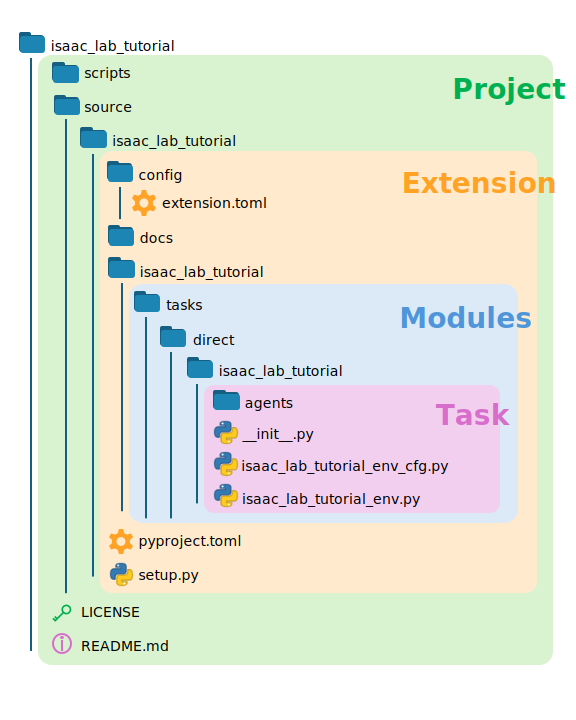

.. _walkthrough_project_setup:

Isaac Lab Project Setup
========================

The best way to create a new project is to use the :ref:`Template Generator<template-generator>`. Generating the template
for this tutorial series is done by calling the ``isaaclab`` script from the root directory of the repository

.. code-block:: bash

    ./isaaclab.sh --new

Be sure to select ``External`` and ``Direct | single agent``.  For the frameworks, select ``skrl`` and both ``PPO`` and ``AMP`` on the following menu.  You can
select other frameworks if you like, but this tutorial will detail ``skrl`` specifically. The configuration process for other frameworks is similar. You
can get a copy of this code directly by checking out the `initial branch of the tutorial repository <https://github.com/isaac-sim/IsaacLabTutorial/tree/initial>`_!

This will create an extension project with the specified name at the chosen path.  For this tutorial, we chose the name ``isaac_lab_tutorial``.

.. note::

    The template generator expects the project name to respect "snake_case": all lowercase with underscores separating words. However, we have renamed the
    sample project to "IsaacLabTutorial" to more closely match the naming convention GitHub and our other projects. If you are following along with the example
    repository, note this minor difference as some superficial path names may change.  If you are following along by building the project yourself, then you can ignore this note.

Next, we must install the project as a python module.  Navigate to the directory that was just created
(it will contain the ``source`` and ``scripts`` directories for the project) and then run the following to install the module.

.. code-block:: bash

    python -m pip install -e source/isaac_lab_tutorial

To verify that things have been setup properly, run

.. code-block:: bash

    python scripts/list_envs.py

from the root directory of your new project.  This should generate a table that looks something like the following

.. code-block:: bash

    +-------------------------------------------------------------------------------------------------------------------------------------------------------------------------------------------------------------------------------------------------------+
    |                                                                                                          Available Environments in Isaac Lab                                                                                                          |
    +--------+---------------------------------------+-----------------------------------------------------------------------------------------------+------------------------------------------------------------------------------------------------------+
    | S. No. | Task Name                             | Entry Point                                                                                   | Config                                                                                               |
    +--------+---------------------------------------+-----------------------------------------------------------------------------------------------+------------------------------------------------------------------------------------------------------+
    |   1    | Template-Isaac-Lab-Tutorial-Direct-v0 | isaac_lab_tutorial.tasks.direct.isaac_lab_tutorial.isaac_lab_tutorial_env:IsaacLabTutorialEnv | isaac_lab_tutorial.tasks.direct.isaac_lab_tutorial.isaac_lab_tutorial_env_cfg:IsaacLabTutorialEnvCfg |
    +--------+---------------------------------------+-----------------------------------------------------------------------------------------------+------------------------------------------------------------------------------------------------------+

We can now use the task name to run the environment.

.. code-block:: bash

    python scripts/skrl/train.py --task=Template-Isaac-Lab-Tutorial-Direct-v0

and by default, this should start a cartpole training environment.

Let the training finish and then run the following command to see the trained policy in action!

.. code-block:: bash

    python scripts/skrl/play.py --task=Template-Isaac-Lab-Tutorial-Direct-v0

Notice that you did not need to specify the path for the checkpoint file! This is because Isaac Lab handles much of the minute details
like checkpoint saving, loading, and logging. In this case, the ``train.py`` script will create two directories: **logs** and **output**, which are
used as the default output directories for tasks run by this project.

Project Structure
-----------------

There are four nested structures you need to be aware of when working in the direct workflow with an Isaac Lab template
project: the **Project**, the **Extension**, the **Modules**, and the **Task**.

The **Project** is the root directory of the generated template.  It contains the source and scripts directories, as well as
a ``README.md`` file. When we created the template, we named the project *IsaacLabTutorial* and this defined the root directory
of a git repository.   If you examine the project root with hidden files visible you will see a number of files defining
the behavior of the project with respect to git. The ``scripts`` directory contains the ``train.py`` and ``play.py`` scripts for the
various RL libraries you chose when generating the template, while the source directory contains the python packages for the project.

The **Extension** is the name of the python package we installed via pip. By default, the template generates a project
with a single extension of the same name. A project can have multiple extensions, and so they are kept in a common ``source``
directory. Traditional python packages are defined by the presence of a ``pyproject.toml`` file that describes the package
metadata, but packages using Isaac Lab must also be Isaac Sim extensions and so require a ``config`` directory and an accompanying
``extension.toml`` file that describes the metadata needed by the Isaac Sim extension manager. Finally, because the template
is intended to be installed via pip, it needs a ``setup.py`` file to complete the setup procedure using the ``extension.toml``
config. A project can have multiple extensions, as evidenced by the Isaac Lab repository itself!

The **Modules** are what actually gets loaded by Isaac Lab to run training (the meat of the code). By default, the template
generates an extension with a single module that is named the same as the project. The structure of the various sub-modules
in the extension is what determines the ``entry_point`` for an environment in Isaac Lab. This is why our template project needed
to be installed before we could call ``train.py``: the path to the necessary components to run the task needed to be exposed
to python for Isaac Lab to find them.

Finally, the **Task** is the heart of the direct workflow. By default, the template generates a single task with the same name
as the project. The environment and configuration files are stored here, as well as placeholder, RL library dependent ``agents``.
Critically, note the contents of the ``__init__.py``! Specifically, the ``gym.register`` function needs to be called at least once
before an environment and task can be used with the Isaac Lab ``train.py`` and ``play.py`` scripts.
This function should be included in one of the module ``__init__.py`` files so it is called at installation. The path to
this init file is what defines the entry point for the task!

For the template, ``gym.register`` is called within ``isaac_lab_tutorial/source/isaac_lab_tutorial/isaac_lab_tutorial/tasks/direct/isaac_lab_tutorial/__init__.py``.
The repeated name is a consequence of needing default names for the template, but now we can see the structure of the project.
**Project**/source/**Extension**/**Module**/tasks/direct/**Task**/__init__.py
