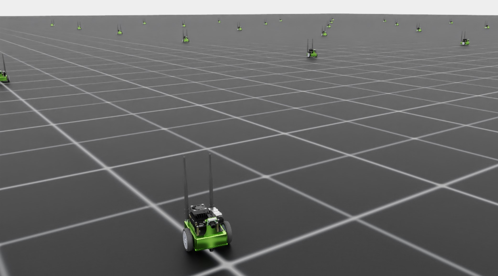

.. _walkthrough_technical_env_design:

Environment Design
====================

Armed with our understanding of the project and its structure, we are ready to start modifying the code to suit our Jetbot training needs.
Our template is set up for the **direct** workflow, which means the environment class will manage all of these details
centrally. We will need to write the code that will...

#. Define the robot
#. Define the training simulation and manage cloning
#. Apply the actions from the agent to the robot
#. Calculate and return the rewards and observations
#. Manage resetting and terminal states

As a first step, our goal will be to get the environment training pipeline to load and run.  We will use a dummy reward signal
for the purposes of this part of the walkthrough. You can find the code for these modifications `here <https://github.com/isaac-sim/IsaacLabTutorial/tree/jetbot-intro-1-1>`_!

Define the Robot
------------------

As our project grows, we may have many robots that we want to train. With malice aforethought we will add a new ``module`` to our
tutorial ``extension`` named ``robots`` where we will keep the definitions for robots as individual python scripts. Navigate
to ``isaac_lab_tutorial/source/isaac_lab_tutorial/isaac_lab_tutorial`` and create a new folder called ``robots``. Within this folder
create two files: ``__init__.py`` and ``jetbot.py``. The ``__init__.py`` file marks this directory as a python module and we will
be able to import the contents of ``jetbot.py`` in the usual way.

The contents of ``jetbot.py`` is fairly minimal

.. code-block:: python

  import isaaclab.sim as sim_utils
  from isaaclab.assets import ArticulationCfg
  from isaaclab.actuators import ImplicitActuatorCfg
  from isaaclab.utils.assets import ISAAC_NUCLEUS_DIR

  JETBOT_CONFIG = ArticulationCfg(
      spawn=sim_utils.UsdFileCfg(usd_path=f"{ISAAC_NUCLEUS_DIR}/Robots/NVIDIA/Jetbot/jetbot.usd"),
      actuators={"wheel_acts": ImplicitActuatorCfg(joint_names_expr=[".*"], damping=None, stiffness=None)},
  )

The only purpose of this file is to define a unique scope in which to save our configurations. The details of robot configurations
can be explored in :ref:`this tutorial <tutorial-add-new-robot>` but most noteworthy for this walkthrough is the ``usd_path`` for the ``spawn``
argument of this ``ArticulationCfg``. The Jetbot asset is available to the public via a hosted nucleus server, and that path is defined by
``ISAAC_NUCLEUS_DIR``, however any path to a USD file is valid, including local ones!

Environment Configuration
---------------------------

Navigate to the environment configuration, ``isaac_lab_tutorial/source/isaac_lab_tutorial/isaac_lab_tutorial/tasks/direct/isaac_lab_tutorial/isaac_lab_tutorial_env_cfg.py``, and
replace its contents with the following

.. code-block:: python

  from isaac_lab_tutorial.robots.jetbot import JETBOT_CONFIG

  from isaaclab.assets import ArticulationCfg
  from isaaclab.envs import DirectRLEnvCfg
  from isaaclab.scene import InteractiveSceneCfg
  from isaaclab.sim import SimulationCfg
  from isaaclab.utils import configclass

  @configclass
  class IsaacLabTutorialEnvCfg(DirectRLEnvCfg):
      # env
      decimation = 2
      episode_length_s = 5.0
      # - spaces definition
      action_space = 2
      observation_space = 3
      state_space = 0
      # simulation
      sim: SimulationCfg = SimulationCfg(dt=1 / 120, render_interval=decimation)
      # robot(s)
      robot_cfg: ArticulationCfg = JETBOT_CONFIG.replace(prim_path="/World/envs/env_.*/Robot")
      # scene
      scene: InteractiveSceneCfg = InteractiveSceneCfg(num_envs=100, env_spacing=4.0, replicate_physics=True)
      dof_names = ["left_wheel_joint", "right_wheel_joint"]

Here we have, effectively, the same environment configuration as before, but with the Jetbot instead of the cartpole. The
parameters ``decimation``, ``episode_length_s``, ``action_space``, ``observation_space``, and ``state_space`` are members of
the base class, ``DirectRLEnvCfg``, and must be defined for every ``DirectRLEnv``. The space parameters are interpreted as vectors of
the given integer dimension, but they can also be defined as `gymnasium spaces <https://gymnasium.farama.org/api/spaces/>`_!

Notice the difference in the action and observation spaces.  As the designers of the environment, we get to choose these.  For the Jetbot, we want to
directly control the joints of the robot, of which only two are actuated (hence the action space of two). The observation space is *chosen* to be
3 because we are just going to feed the agent the linear velocity of the Jetbot, for now.  We will change these later as we develop the environment. Our policy isn't going
to need an internal state maintained, so our state space is zero.

Attack of the clones
---------------------

With the config defined, it's time to fill in the details of the environment, starting with the initialization and setup.
Navigate to the environment definition, ``isaac_lab_tutorial/source/isaac_lab_tutorial/isaac_lab_tutorial/tasks/direct/isaac_lab_tutorial/isaac_lab_tutorial_env.py``, and
replace the contents of the ``__init__`` and ``_setup_scene`` methods with the following.

.. code-block:: python

  class IsaacLabTutorialEnv(DirectRLEnv):
      cfg: IsaacLabTutorialEnvCfg

      def __init__(self, cfg: IsaacLabTutorialEnvCfg, render_mode: str | None = None, **kwargs):
          super().__init__(cfg, render_mode, **kwargs)

          self.dof_idx, _ = self.robot.find_joints(self.cfg.dof_names)

      def _setup_scene(self):
          self.robot = Articulation(self.cfg.robot_cfg)
          # add ground plane
          spawn_ground_plane(prim_path="/World/ground", cfg=GroundPlaneCfg())
          # clone and replicate
          self.scene.clone_environments(copy_from_source=False)
          # add articulation to scene
          self.scene.articulations["robot"] = self.robot
          # add lights
          light_cfg = sim_utils.DomeLightCfg(intensity=2000.0, color=(0.75, 0.75, 0.75))
          light_cfg.func("/World/Light", light_cfg)

Notice that the ``_setup_scene`` method doesn't change and the ``_init__`` method is simply grabbing the joint indices from the robot (remember, setup is called in super).

The next thing our environment needs is the definitions for how to handle actions, observations, and rewards. First, replace the contents of ``_pre_physics_step`` and
``_apply_action`` with the following.

.. code-block:: python

    def _pre_physics_step(self, actions: torch.Tensor) -> None:
        self.actions = actions.clone()

    def _apply_action(self) -> None:
        self.robot.set_joint_velocity_target(self.actions, joint_ids=self.dof_idx)

Here the act of applying actions to the robot in the environment is broken into two steps: ``_pre_physics_step`` and ``_apply_action``. The physics
simulation is decimated with respect to querying the policy for actions, meaning that multiple physics steps may occur per action taken by the policy.
The ``_pre_physics_step`` method is called just before this simulation step takes place and lets us detach the process of getting data from the
policy being trained and applying updates to the physics simulation. The ``_apply_action`` method is where those actions are actually applied to the robots
on the stage, after which the simulation is actually stepped forward in time.

Next is the observations and rewards, which is just going to depend on the linear velocity of the Jetbot in the body frame of the robot. Replace the contents of ``_get_observations``
and ``_get_rewards`` with the following.

.. code-block:: python

    def _get_observations(self) -> dict:
        self.velocity = self.robot.data.root_com_lin_vel_b
        observations = {"policy": self.velocity}
        return observations

    def _get_rewards(self) -> torch.Tensor:
        total_reward = torch.linalg.norm(self.velocity, dim=-1, keepdim=True)
        return total_reward

The robot exists as an Articulation object within the Isaac Lab API. That object carries a data class, the ``ArticulationData``, which contains all the data for **specific** robots on the stage.
When we talk about a scene entity like the robot, we can either be talking about the robot broadly, as an entity that exists in every scene, or we can be describing a specific, singular clone
of the robot on the stage. The ``ArticulationData`` contains the data for those individual clones. This includes things like various kinematic vectors (like ``root_com_lin_vel_b``) and reference
vectors (like ``robot.data.FORWARD_VEC_B``).

Notice how in the ``_apply_action`` method, we are calling a method of ``self.robot`` which is a method of ``Articulation``. The actions being applied are in the form of a 2D tensor
of shape ``[num_envs, num_actions]``. We are applying actions to **all** robots on the stage at once! Here, when we need to get the observations, we need the body frame velocity for all robots on the
stage, and so access ``self.robot.data`` to get that information. The ``root_com_lin_vel_b`` is a property of the ``ArticulationData`` that handles the conversion of the center-of-mass linear velocity from the world frame
to the body frame for us. Finally, Isaac Lab expects the observations to be returned as a dictionary, with ``policy`` defining those observations for the policy model and ``critic`` defining those observations for
the critic model (in the case of asymmetric actor critic training). Since we are not doing asymmetric actor critic, we only need to define ``policy``.

The rewards are more straightforward. For each clone of the scene, we need to compute a reward value and return it as a tensor of shape ``[num_envs, 1]``. As a place holder, we will make the reward the
magnitude of the linear velocity of the Jetbot in the body frame. With this reward and observation space, the agent should learn to drive the Jetbot forward or backward, with the direction determined at random
shortly after training starts.

Finally, we can write the parts of the environment to handle termination and resetting.  Replace the contents of ``_get_dones`` and ``_reset_idx`` with the following.

.. code-block:: python

    def _get_dones(self) -> tuple[torch.Tensor, torch.Tensor]:
        time_out = self.episode_length_buf >= self.max_episode_length - 1

        return False, time_out

    def _reset_idx(self, env_ids: Sequence[int] | None):
        if env_ids is None:
            env_ids = self.robot._ALL_INDICES
        super()._reset_idx(env_ids)

        default_root_state = self.robot.data.default_root_state[env_ids]
        default_root_state[:, :3] += self.scene.env_origins[env_ids]

        self.robot.write_root_state_to_sim(default_root_state, env_ids)

Like the actions, termination and resetting are handled in two parts.  First is the ``_get_dones`` method, the goal of which is simply to mark which environments need to be reset and why.
Traditionally in reinforcement learning, an "episode" ends in one of two ways: either the agent reaches a terminal state, or the episode reaches a maximum duration.
Isaac Lab is kind to us, because it manages all of this episode duration tracking behind the scenes.  The configuration parameter ``episode_length_s`` defines this maximum episode length in
seconds and the parameters ``episode_length_buff`` and ``max_episode_length`` contain the number of steps taken by individual scenes (allowing for asynchronous running of the environment) and the
maximum length of the episode as converted from ``episode_length_s``. The boolean operation computing ``time_out`` just compares the current buffer size to the max and returns true if it's greater, thus
indicating which scenes are at the episode length limit. Since our current environment is a dummy, we don't define terminal states and so just return ``False`` for the first tensor (this gets projected automatically
to the correct shape through the power of pytorch).

Finally, the ``_reset_idx`` method accepts a tensor of booleans indicating which scenes need to be reset, and resets them. Notice that this is the only other method of ``DirectRLEnv`` that directly calls
``super``, which is done so here to manage the internal buffers related to episode length.  For those environments indicated by ``env_ids`` we retrieve the root default state, and reset the robot to that state while
also offsetting the position of each robot according to the origin of the corresponding scene. This is a consequence of the cloning procedure, which starts with a single robot and a single default state defined in the world
frame. Don't forget this step for your own custom environments!

With these changes complete, you should see the Jetbot slowly learn to drive forward when you launch the task with the template ``train.py`` script.

