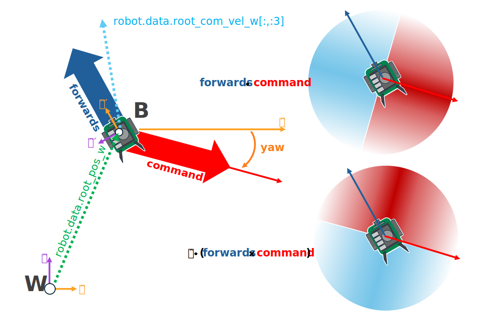
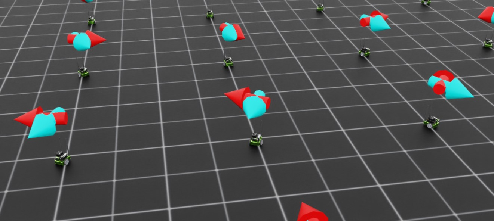
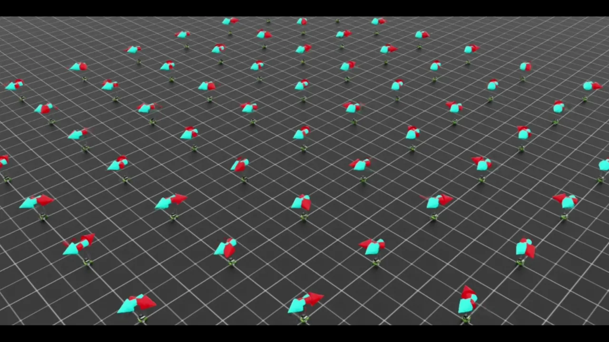

.. _walkthrough_training_jetbot_gt:

Training the Jetbot: Ground Truth
======================================

With the environment defined, we can now start modifying our observations and rewards in order to train a policy
to act as a controller for the Jetbot. As a user, we would like to be able to specify the desired direction for the Jetbot to drive,
and have the wheels turn such that the robot drives in that specified direction as fast as possible. How do we achieve this with
Reinforcement Learning (RL)? If you want to cut to the end and checkout the result of this stage of the walk through, checkout 
`this branch of the tutorial repository <https://github.com/isaac-sim/isaac_lab_tutorial/tree/jetbot-intro-1-2>`_!

Expanding the Environment
--------------------------

The very first thing we need to do is create the logic for setting commands for each Jetbot on the stage. Each command will be a unit vector, and
we need one for every clone of the robot on the stage, which means a tensor of shape ``[num_envs, 3]``. Even though the Jetbot only navigates in the
2D plane, by working with 3D vectors we get to make use of all the math utilities provided by Isaac Lab.

It would also be a good idea to setup visualizations, so we can more easily tell what the policy is doing during training and inference.
In this case, we will define two arrow ``VisualizationMarkers``: one to represent the "forward" direction of the robot, and one to
represent the command direction.  When the policy is fully trained, these arrows should be aligned! Having these visualizations in place
early helps us avoid "silent bugs": issues in the code that do not cause it to crash.

To begin, we need to define the marker config and then instantiate the markers with that config. Add the following to the global scope of ``isaac_lab_tutorial_env.py``

.. code-block:: python

  from isaaclab.markers import VisualizationMarkers, VisualizationMarkersCfg
  from isaaclab.utils.assets import ISAAC_NUCLEUS_DIR
  import isaaclab.utils.math as math_utils

  def define_markers() -> VisualizationMarkers:
      """Define markers with various different shapes."""
      marker_cfg = VisualizationMarkersCfg(
          prim_path="/Visuals/myMarkers",
          markers={
                  "forward": sim_utils.UsdFileCfg(
                      usd_path=f"{ISAAC_NUCLEUS_DIR}/Props/UIElements/arrow_x.usd",
                      scale=(0.25, 0.25, 0.5),
                      visual_material=sim_utils.PreviewSurfaceCfg(diffuse_color=(0.0, 1.0, 1.0)),
                  ),
                  "command": sim_utils.UsdFileCfg(
                      usd_path=f"{ISAAC_NUCLEUS_DIR}/Props/UIElements/arrow_x.usd",
                      scale=(0.25, 0.25, 0.5),
                      visual_material=sim_utils.PreviewSurfaceCfg(diffuse_color=(1.0, 0.0, 0.0)),
                  ),
          },
      )
      return VisualizationMarkers(cfg=marker_cfg)

The ``VisualizationMarkersCfg`` defines USD prims to serve as the "marker".  Any prim will do, but generally you want to keep markers as simple as possible because the cloning of markers occurs at runtime on every time step.
This is because the purpose of these markers is for *debug visualization only* and not to be a part of the simulation: the user has full control over how many markers to draw when and where.
NVIDIA provides several simple meshes on our public nucleus server, located at ``ISAAC_NUCLEUS_DIR``, and for obvious reasons we choose to use ``arrow_x.usd``.

For a more detailed example of using ``VisualizationMarkers`` checkout the ``markers.py`` demo!

.. dropdown:: Code for the markers.py demo
   :icon: code

   .. literalinclude:: ../../../../scripts/demos/markers.py
      :language: python
      :linenos:

Next, we need to expand the initialization and setup steps to construct the data we need for tracking the commands as well as the marker positions and rotations. Replace the contents of
``_setup_scene`` with the following

.. code-block:: python

    def _setup_scene(self):
        self.robot = Articulation(self.cfg.robot_cfg)
        # add ground plane
        spawn_ground_plane(prim_path="/World/ground", cfg=GroundPlaneCfg())
        # clone and replicate
        self.scene.clone_environments(copy_from_source=False)
        # add articulation to scene
        self.scene.articulations["robot"] = self.robot
        # add lights
        light_cfg = sim_utils.DomeLightCfg(intensity=2000.0, color=(0.75, 0.75, 0.75))
        light_cfg.func("/World/Light", light_cfg)

        self.visualization_markers = define_markers()

        self.up_dir = torch.tensor([0.0, 0.0, 1.0]).cuda()
        self.yaws = torch.zeros((self.cfg.scene.num_envs, 1)).cuda()
        self.commands = torch.randn((self.cfg.scene.num_envs, 3)).cuda()
        self.commands[:,-1] = 0.0
        self.commands = self.commands/torch.linalg.norm(self.commands, dim=1, keepdim=True)

        ratio = self.commands[:,1]/(self.commands[:,0]+1E-8)
        gzero = torch.where(self.commands > 0, True, False)
        lzero = torch.where(self.commands < 0, True, False)
        plus = lzero[:,0]*gzero[:,1]
        minus = lzero[:,0]*lzero[:,1]
        offsets = torch.pi*plus - torch.pi*minus
        self.yaws = torch.atan(ratio).reshape(-1,1) + offsets.reshape(-1,1)

        self.marker_locations = torch.zeros((self.cfg.scene.num_envs, 3)).cuda()
        self.marker_offset = torch.zeros((self.cfg.scene.num_envs, 3)).cuda()
        self.marker_offset[:,-1] = 0.5
        self.forward_marker_orientations = torch.zeros((self.cfg.scene.num_envs, 4)).cuda()
        self.command_marker_orientations = torch.zeros((self.cfg.scene.num_envs, 4)).cuda()

Most of this is setting up the book keeping for the commands and markers, but the command initialization and the yaw calculations are worth diving into. The commands
are sampled from a multivariate normal distribution via ``torch.randn`` with the z component fixed to zero and then normalized to unit length. In order to point our
command markers along these vectors, we need to rotate the base arrow mesh appropriately. This means we need to define a `quaternion <https://en.wikipedia.org/wiki/Quaternion>`_` that will rotate the arrow
prim about the z axis by some angle defined by the command. By convention, rotations about the z axis are called a "yaw" rotation (akin to roll and pitch).

Luckily for us, Isaac Lab provides a utility to generate a quaternion from an axis of rotation and an angle: :func:`isaaclab.utils.math.quat_from_axis_angle`, so the only
tricky part now is determining that angle.

The yaw is defined about the z axis, with a yaw of 0 aligning with the x axis and positive angles opening counterclockwise. The x and y components of the command vector
define the tangent of this angle, and so we need the *arctangent* of that ratio to get the yaw.

Now, consider two commands: Command A is in quadrant 2 at (-x, y), while command B is in quadrant 4 at (x, -y). The ratio of the
y component to the x component is identical for both A and B. If we do not account for this, then some of our command arrows will be
pointing in the opposite direction of the command! Essentially, our commands are defined on ``[-pi, pi]`` but ``arctangent`` is
only defined on ``[-pi/2, pi/2]``.

To remedy this, we add or subtract ``pi`` from the yaw depending on the quadrant of the command.

.. code-block:: python

        ratio = self.commands[:,1]/(self.commands[:,0]+1E-8) #in case the x component is zero
        gzero = torch.where(self.commands > 0, True, False)
        lzero = torch.where(self.commands < 0, True, False)
        plus = lzero[:,0]*gzero[:,1]
        minus = lzero[:,0]*lzero[:,1]
        offsets = torch.pi*plus - torch.pi*minus
        self.yaws = torch.atan(ratio).reshape(-1,1) + offsets.reshape(-1,1)

Boolean expressions involving tensors can have ambiguous definitions and pytorch will throw errors regarding this. Pytorch provides
various methods to make the definitions explicit. The method ``torch.where`` produces a tensor with the same shape as the input
with each element of the output is determined by the evaluation of that expression on only that element. A reliable way to handle
boolean operations with tensors is to simply produce boolean indexing tensors and then represent the operation algebraically, with ``AND``
as multiplication and ``OR`` as addition, which is what we do above.  This is equivalent to the pseudocode:

.. code-block:: python

    yaws = torch.atan(ratio)
    yaws[commands[:,0] < 0 and commands[:,1] > 0] += torch.pi
    yaws[commands[:,0] < 0 and commands[:,1] < 0] -= torch.pi

Next we have the method for actually visualizing the markers. Remember, these markers aren't scene entities! We need to "draw" them whenever we
want to see them.

.. code-block:: python

    def _visualize_markers(self):
        self.marker_locations = self.robot.data.root_pos_w
        self.forward_marker_orientations = self.robot.data.root_quat_w
        self.command_marker_orientations = math_utils.quat_from_angle_axis(self.yaws, self.up_dir).squeeze()

        loc = self.marker_locations + self.marker_offset
        loc = torch.vstack((loc, loc))
        rots = torch.vstack((self.forward_marker_orientations, self.command_marker_orientations))

        all_envs = torch.arange(self.cfg.scene.num_envs)
        indices = torch.hstack((torch.zeros_like(all_envs), torch.ones_like(all_envs)))

        self.visualization_markers.visualize(loc, rots, marker_indices=indices)

The ``visualize`` method of ``VisualizationMarkers`` is  like this "draw" function. It accepts tensors for the spatial
transformations of the markers, and a ``marker_indices`` tensor to specify which marker prototype to use for each marker. So
long as the first dimension of all of these tensors match, this function will draw those markers with the specified transformations.
This is why we stack the locations, rotations, and indices.

Now we just need to call ``_visualize_markers`` on the pre physics step to make the arrows visible. Replace ``_pre_physics_step`` with the following

.. code-block:: python

      def _pre_physics_step(self, actions: torch.Tensor) -> None:
        self.actions = actions.clone()
        self._visualize_markers()

The last major modification before we dig into the RL training is to update the ``_reset_idx`` method to account for the commands and markers. Whenever we reset an environment,
we need to generate a new command and reset the markers. The logic for this is already covered above. Replace the contents of ``_reset_idx`` with the following:

.. code-block:: python

    def _reset_idx(self, env_ids: Sequence[int] | None):
        if env_ids is None:
            env_ids = self.robot._ALL_INDICES
        super()._reset_idx(env_ids)

        self.commands[env_ids] = torch.randn((len(env_ids), 3)).cuda()
        self.commands[env_ids,-1] = 0.0
        self.commands[env_ids] = self.commands[env_ids]/torch.linalg.norm(self.commands[env_ids], dim=1, keepdim=True)

        ratio = self.commands[env_ids][:,1]/(self.commands[env_ids][:,0]+1E-8)
        gzero = torch.where(self.commands[env_ids] > 0, True, False)
        lzero = torch.where(self.commands[env_ids]< 0, True, False)
        plus = lzero[:,0]*gzero[:,1]
        minus = lzero[:,0]*lzero[:,1]
        offsets = torch.pi*plus - torch.pi*minus
        self.yaws[env_ids] = torch.atan(ratio).reshape(-1,1) + offsets.reshape(-1,1)

        default_root_state = self.robot.data.default_root_state[env_ids]
        default_root_state[:, :3] += self.scene.env_origins[env_ids]

        self.robot.write_root_state_to_sim(default_root_state, env_ids)
        self._visualize_markers()

And that's it! We now generate commands and can visualize it the heading of the Jetbot. We are ready to start tinkering with the observations and rewards.

Exploring the RL problem
--------------------------

The command to the Jetbot is a unit vector in specifying the desired drive direction and we must make the agent aware of this some how
so it can adjust its actions accordingly.  There are many possible ways to do this, with the "zeroth order" approach to simply change the observation space to include
this command. To start, **edit the ``IsaacLabTutorialEnvCfg`` to set the observation space to 9**: the world velocity vector contains the linear and angular velocities
of the robot, which is 6 dimensions and if we append the command to this vector, that's 9 dimensions for the observation space in total.

Next, we just need to do that appending when we get the observations.  We also need to calculate our forward vectors for later use. The forward vector for the Jetbot is
the x axis, so we apply the ``root_link_quat_w`` to ``[1,0,0]`` to get the forward vector in the world frame. Replace the ``_get_observations`` method with the following:

.. code-block:: python

    def _get_observations(self) -> dict:
        self.velocity = self.robot.data.root_com_vel_w
        self.forwards = math_utils.quat_apply(self.robot.data.root_link_quat_w, self.robot.data.FORWARD_VEC_B)
        obs = torch.hstack((self.velocity, self.commands))
        observations = {"policy": obs}
        return observations

 So now what should the reward be?

When the robot is behaving as desired, it will be driving at full speed in the direction of the command. If we reward both
"driving forward" and "alignment to the command", then maximizing that combined signal should result in driving to the command... right?

Let's give it a try! Replace the ``_get_rewards`` method with the following:

.. code-block:: python

    def _get_rewards(self) -> torch.Tensor:
        forward_reward = self.robot.data.root_com_lin_vel_b[:,0].reshape(-1,1)
        alignment_reward = torch.sum(self.forwards * self.commands, dim=-1, keepdim=True)
        total_reward = forward_reward + alignment_reward
        return total_reward

The ``forward_reward`` is the x component of the linear center of mass velocity of the robot in the body frame. We know that
the x direction is the forward direction for the asset, so this should be equivalent to inner product between the forward vector and
the linear velocity in the world frame.  The alignment term is the inner product between the forward vector and the command vector: when they are
pointing in the same direction this term will be 1, but in the opposite direction it will be -1.  We add them together to get the combined reward and
we can finally run training!  Let's see what happens!

.. code-block:: bash

    python scripts/skrl/train.py --task=Template-Isaac-Lab-Tutorial-Direct-v0

Surely we can do better!

Reward and Observation Tuning
-------------------------------

When tuning an environment for training, as a rule of thumb, you want to keep the observation space as small as possible.  This is to
reduce the number parameters in the model (the literal interpretation of Occam's razor) and thus improve training time. In this case we
need to somehow encode our alignment to the command and our forward speed. One way to do this is to exploit the dot and cross products
from linear algebra! Replace the contents of ``_get_observations`` with the following:

.. code-block:: python

    def _get_observations(self) -> dict:
        self.velocity = self.robot.data.root_com_vel_w
        self.forwards = math_utils.quat_apply(self.robot.data.root_link_quat_w, self.robot.data.FORWARD_VEC_B)

        dot = torch.sum(self.forwards * self.commands, dim=-1, keepdim=True)
        cross = torch.cross(self.forwards, self.commands, dim=-1)[:,-1].reshape(-1,1)
        forward_speed = self.robot.data.root_com_lin_vel_b[:,0].reshape(-1,1)
        obs = torch.hstack((dot, cross, forward_speed))

        observations = {"policy": obs}
        return observations

The dot or inner product tells us how aligned two vectors are as a single scalar quantity.  If they are very aligned and pointed in the same direction, then the inner
product will be large and positive, but if they are aligned and in opposite directions, it will be large and negative.  If two vectors are
perpendicular, the inner product is zero. This means that the inner product between the forward vector and the command vector can tell us
how much we are facing towards or away from the command, but not which direction we need to turn to improve alignment.

the cross product also tells us how aligned two vectors are, but it expresses this relationship as a vector.  The cross product between any
two vectors defines an axis that is perpendicular to the plane containing the two argument vectors, where the direction of the result vector along this axis is
determined by the chirality (dimension ordering, or handedness) of the coordinate system. In our case, we can exploit the fact that we are operating in 2D to only
examine the z component of the result of :math:`\vec{forward} \times \vec{command}`. This component will be zero if the vectors are colinear, positive if the
command vector is to the left of forward, and negative if it's to the right.

Finally, the x component of the center of mass linear velocity tells us our forward speed, with positive being forward and negative being backwards. We stack these together
"horizontally" (along dim 1) to generate the observations for each Jetbot. This alone improves performance!

.. figure:: ../../_static/setup/walkthrough_improved_webp.webp
    :align: center
    :figwidth: 100%
    :alt: Improved results

It seems to qualitatively train better, and the Jetbots are somewhat inching forward... Surely we can do better still!

Another rule of thumb for training is to reduce and simplify the reward function as much as possible.  Terms in the reward behave similarly to
the logical "OR" operation.  In our case, we are rewarding driving forward and being aligned to the command by adding them together, so our agent
can be reward for driving forward OR being aligned to the command. To force the agent to learn to drive in the direction of the command, we should only
reward the agent driving forward AND being aligned. Logical AND suggests multiplication and therefore the following reward function:

.. code-block:: python

    def _get_rewards(self) -> torch.Tensor:
        forward_reward = self.robot.data.root_com_lin_vel_b[:,0].reshape(-1,1)
        alignment_reward = torch.sum(self.forwards * self.commands, dim=-1, keepdim=True)
        total_reward = forward_reward*alignment_reward
        return total_reward

Now we will only get rewarded for driving forward if our alignment reward is non zero.  Let's see what kind of result this produces!

.. figure:: ../../_static/setup/walkthrough_tuned_webp.webp
    :align: center
    :figwidth: 100%
    :alt: Tuned results

It definitely trains faster, but the Jetbots have learned to drive in reverse if the command is pointed behind them. This may be desirable in our
case, but it shows just how dependent the policy behavior is on the reward function.  In this case, there are **degenerate solutions** to our
reward function: The reward is maximized for driving forward and aligned to the command, but if the Jetbot drives in reverse, then the forward
term is negative, and if its driving in reverse towards the command, then the alignment term is **also negative**, meaning hat the reward is positive!
When you design your own environments, you will run into degenerate solutions like this and a significant amount of reward engineering is devoted to
suppressing or supporting these behaviors by modifying the reward function.

Let's say, in our case, we don't want this behavior. In our case, the alignment term has a domain of ``[-1, 1]``, but we would much prefer it to be mapped
only to positive values. We don't want to *eliminate* the sign on the alignment term, rather, we would like large negative values to be near zero, so if we
are misaligned, we don't get rewarded. The exponential function accomplishes this!

.. code-block:: python

    def _get_rewards(self) -> torch.Tensor:
        forward_reward = self.robot.data.root_com_lin_vel_b[:,0].reshape(-1,1)
        alignment_reward = torch.sum(self.forwards * self.commands, dim=-1, keepdim=True)
        total_reward = forward_reward*torch.exp(alignment_reward)
        return total_reward

Now when we train, the Jetbots will turn to always drive towards the command in the forward direction!

.. figure:: ../../_static/setup/walkthrough_directed_webp.webp
    :align: center
    :figwidth: 100%
    :alt: Directed results
