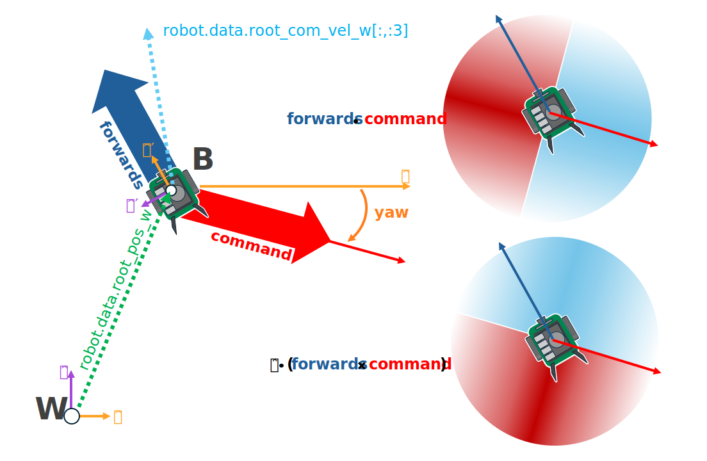

.. _walkthrough_training_jetbot_gt:

Training the Jetbot: Ground Truth
======================================

With the environment defined, we can now start modifying our observations and rewards in order to train a policy 
to act as a controller for the Jetbot. As a user, we would like to be able to specify the desired direction for the Jetbot to drive, 
and have the wheels turn such that the robot drives in that specified direction as fast as possible. How do we achieve this with 
Reinforcement Learning (RL)?

Expanding the Environment
--------------------------

The very first thing we need to do is create the logic for setting commands for each Jetbot on the stage. Each command will be a unit vector, and 
we need one for every clone of the robot on the stage, which means a tensor of shape ``[num_envs, 3]``. Even though the Jetbot only navigates in the 
2D plane, by working with 3D vectors we get to make use of all the math utilities provided by Isaac Lab.  

It would also be a good idea to setup visualizations, so we can more easily tell what the policy is doing during training and inference.  
In this case, we will define two arrow ``VisualizationMarkers``: one to represent the "forward" direction of the robot, and one to 
represent the command direction.  When the policy is fully trained, these arrows should be aligned! Having these visualizations in place 
early helps us avoid "silent bugs": issues in the code that do not cause it to crash. 

To begin, we need to define the marker config and then instantiate the markers with that config. Add the following to the global scope of ``isaac_lab_tutorial_env.py``

.. code-block:: python

  from isaaclab.markers import VisualizationMarkers, VisualizationMarkersCfg
  from isaaclab.utils.assets import ISAAC_NUCLEUS_DIR
  import isaaclab.utils.math as math_utils

  def define_markers() -> VisualizationMarkers:
      """Define markers with various different shapes."""
      marker_cfg = VisualizationMarkersCfg(
          prim_path="/Visuals/myMarkers",
          markers={
                  "forward": sim_utils.UsdFileCfg(
                      usd_path=f"{ISAAC_NUCLEUS_DIR}/Props/UIElements/arrow_x.usd",
                      scale=(0.5, 0.5, 1.0),
                      visual_material=sim_utils.PreviewSurfaceCfg(diffuse_color=(0.0, 1.0, 1.0)),
                  ),
                  "command": sim_utils.UsdFileCfg(
                      usd_path=f"{ISAAC_NUCLEUS_DIR}/Props/UIElements/arrow_x.usd",
                      scale=(0.5, 0.5, 1.0),
                      visual_material=sim_utils.PreviewSurfaceCfg(diffuse_color=(1.0, 0.0, 0.0)),
                  ),
          },
      )
      return VisualizationMarkers(cfg=marker_cfg)

The ``VisualizationMarkersCfg`` defines USD prims to serve as the "marker".  Any prim will do, but generally you want to keep markers as simple as possible because the cloning of markers occurs at runtime on every time step.
This is because the purpose of these markers is for *debug visualization only* and not to be a part of the simulation: the user has full control over how many markers to draw when and where. 
NVIDIA provides several simple meshes on our public nucleus server, located at ``ISAAC_NUCLEUS_DIR``, and for obvious reasons we choose to use ``arrow_x.usd``.

For a more detailed example of using ``VisualizationMarkers`` checkout the ``markers.py`` demo!

.. dropdown:: Code for the markers.py demo
   :icon: code

   .. literalinclude:: ../../../../scripts/demos/markers.py
      :language: python
      :linenos:

Next, we need to expand the initialization and setup steps to construct the data we need for tracking the commands as well as the marker positions and rotations. Replace the contents of 
``_setup_scene`` with the following

.. code-block:: python

    def _setup_scene(self):
        self.visualization_markers = define_markers()
        self.robot = Articulation(self.cfg.robot_cfg)
        # add ground plane
        spawn_ground_plane(prim_path="/World/ground", cfg=GroundPlaneCfg())
        # clone and replicate
        self.scene.clone_environments(copy_from_source=False)
        # add articulation to scene
        self.scene.articulations["robot"] = self.robot
        # add lights
        light_cfg = sim_utils.DomeLightCfg(intensity=2000.0, color=(0.75, 0.75, 0.75))
        light_cfg.func("/World/Light", light_cfg)

        self.all_envs = torch.arange(self.cfg.scene.num_envs)
        self.up_dir = torch.tensor([0.0, 0.0, 1.0]).cuda()  
        self.yaws = torch.zeros((self.cfg.scene.num_envs, 1)).cuda()

        self.commands = torch.randn((self.cfg.scene.num_envs, 3)).cuda()
        self.commands[:,-1] = 0.0
        self.commands = self.commands/torch.linalg.norm(self.commands, dim=1, keepdim=True)
        
        ratio = self.commands[:,1]/(self.commands[:,0]+1E-8)
        
        gzero = torch.where(self.commands > 0, True, False)
        lzero = torch.where(self.commands < 0, True, False)
        plus = lzero[:,0]*gzero[:,1]
        minus = lzero[:,0]*lzero[:,1]
        offsets = torch.pi*plus - torch.pi*minus

        self.yaws = torch.atan(ratio).reshape(-1,1) + offsets.reshape(-1,1)

        self.marker_locations = torch.zeros((self.cfg.scene.num_envs, 3)).cuda()
        self.marker_offset = torch.zeros((self.cfg.scene.num_envs, 3)).cuda()
        self.marker_offset[:,-1] = 0.5
        self.forward_marker_orientations = torch.zeros((self.cfg.scene.num_envs, 4)).cuda()
        self.command_marker_orientations = torch.zeros((self.cfg.scene.num_envs, 4)).cuda()

Exploring the problem
-----------------------

The command to the Jetbot is a unit vector in specifying the desired drive direction and we must make the agent aware of this some how
so it can adjust its actions accordingly.  There are many possible ways to do this, with the "zeroth order" approach to simply change the observation space to include 
this command. Maybe something like...

.. code-block:: python

    def _get_observations(self) -> dict:
        self.velocity = self.robot.data.root_com_vel_w 
        obs = torch.hstack((self.velocity, self.commands))
        observations = {"policy": obs}
        return observations

where ``self.commands`` is a tensor of the desired driving directions, one for each Jetbot on the stage. The root 