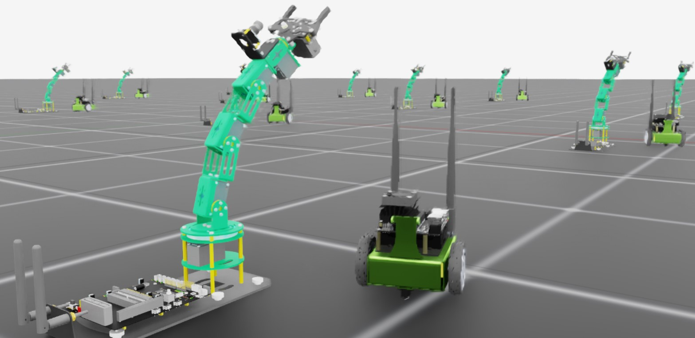

.. _tutorial-add-new-robot:

Adding a New Robot to Isaac Lab
===============================

.. currentmodule:: isaaclab

Simulating and training a new robot is a multi-step process that starts with importing the robot into Isaac Sim.
This is covered in depth in the Isaac Sim documentation `here <https://docs.isaacsim.omniverse.nvidia.com/latest/importer_exporter/importers_exporters.html>`_.
Once the robot is imported and tuned for simulation, we must define those interfaces necessary to clone the robot across multiple environments, drive its joints,
and properly reset it, regardless of the chosen workflow or training framework.

In this tutorial, we will examine how to add a new robot to Isaac Lab. The key step is creating an ``AssetBaseCfg`` that defines
the interface between the USD articulation of the robot and the learning algorithms available through Isaac Lab.

The Code
~~~~~~~~

The tutorial corresponds to the ``add_new_robot`` script in the ``scripts/tutorials/01_assets`` directory.

.. dropdown:: Code for add_new_robot.py
   :icon: code

   .. literalinclude:: ../../../../scripts/tutorials/01_assets/add_new_robot.py
      :language: python
      :linenos:

The Code Explained
~~~~~~~~~~~~~~~~~~

Fundamentally, a robot is an articulation with joint drives.  To move a robot around in the simulation, we must apply
targets to its drives and step the sim forward in time. However, to control a robot strictly through joint drives is tedious, especially if
you want to control anything complex, and doubly so if you want to clone the robot across multiple environments.

To facilitate this, Isaac Lab provides a collection of ``configuration`` classes that define which parts of the USD need
to be cloned, which parts are actuators to be controlled by an agent, how it should be reset, etc... There are many ways
you can configure a single robot asset for Isaac Lab depending on how much fine tuning the asset requires. To demonstrate,
the tutorial script imports two robots: The first robot, the ``Jetbot``, is configured minimally while the second robot, the ``Dofbot``, is configured with additional parameters.

The Jetbot is a simple, two wheeled differential base with a camera on top. The asset is used for a number of demonstrations and
tutorials in Isaac Sim, so we know it's good to go! To bring it into Isaac lab, we must first define one of these configurations.
Because a robot is an articulation with joint drives, we define an ``ArticulationCfg`` that describes the robot.

.. literalinclude:: ../../../../scripts/tutorials/01_assets/add_new_robot.py
    :language: python
    :lines: 27-38

This is the minimal configuration for a robot in Isaac Lab. There are only two required parameters: ``spawn`` and ``actuators``.

The ``spawn`` parameter is looking for a ``SpawnerCfg``, and is used to specify the USD asset that defines the robot in the sim.
The Isaac Lab simulation utilities, ``isaaclab.sim``, provides us with a ``USDFileCfg`` class that consumes a path to our USD
asset, and generates the ``SpawnerCfg`` we need. In this case, the ``jetbot.usd`` is located
with the `Isaac Assets <https://docs.isaacsim.omniverse.nvidia.com/latest/assets/usd_assets_overview.html>`_ under ``Robots/Jetbot/jetbot.usd``.

The ``actuators`` parameter is a dictionary of Actuator Configs and defines what parts of the robot we intend to control with an agent.
There are many different ways to update the state of a joint in time towards some target.  Isaac Lab provides a collection of actuator
classes that can be used to match  common actuator models or even implement your own! In this case, we are using the ``ImplicitActuatorCfg`` class to specify
the actuators for the robot, because they are simple wheels and the defaults are fine.

Specifying joint name keys for this dictionary can be done to varying levels of specificity.
The jetbot only has a few joints, and we are just going to use the defaults specified in the USD asset, so we can use a simple regex, ``.*`` to specify all joints.
Other regex can also be used to group joints and associated configurations.

.. note::

      Both stiffness and damping must be specified in the implicit actuator, but a value of ``None`` will use the defaults defined in the USD asset.

While this is the minimal configuration, there are a number of other parameters we could specify

.. literalinclude:: ../../../../scripts/tutorials/01_assets/add_new_robot.py
    :language: python
    :lines: 39-82

This configuration can be used to add a Dofbot to the scene, and it contains some of those parameters.
The Dofbot is a hobbiest robot arm with several joints, and so we have more options available for configuration.
The two most notable differences though is the addition of configurations for physics properties, and the initial state of the robot, ``init_state``.

The ``USDFileCfg`` has special parameters for rigid bodies and robots, among others. The ``rigid_props`` parameter expects
a ``RigidBodyPropertiesCfg`` that allows you to specify body link properties of the robot being spawned relating to its behavior
as a "physical object" in the simulation. The ``articulation_props`` meanwhile governs the properties relating to the solver
being used to step the joints through time, and so it expects an ``ArticulationRootPropertiesCfg`` to be configured.
There are many other physics properties and parameters that can be specified through configurations provided by :class:`isaaclab.sim.schemas`.

The ``ArticulationCfg`` can optionally include the ``init_state`` parameter, that defines the initial state of the articulation.
The initial state of an articulation is a special, user defined state that is used when the robot is spawned or reset by Isaac Lab.
The initial joint state, ``joint_pos``, is specified by a dictionary of floats with the USD joint names as keys (**not** the actuator names).
Something else worth noting here is the coordinate system of the initial position, ``pos``, which is that of the environment.
In this case, by specifying a position of ``(0.25, -0.25, 0.0)`` we are offsetting the spawn position of the robot **from the origin of the environment**, and not the world.

Armed with the configurations for these robots, we can now add them to the scene and interact with them in the usual way
for the direct workflow: by defining an ``InteractiveSceneCfg`` containing the articulation configs for the robots ...

.. literalinclude:: ../../../../scripts/tutorials/01_assets/add_new_robot.py
    :language: python
    :lines: 85 - 99

...and then stepping the simulation while updating the scene entities appropriately.

.. literalinclude:: ../../../../scripts/tutorials/01_assets/add_new_robot.py
    :language: python
    :lines: 101 - 158

.. note::

      You may see a warning that not all actuators are configured! This is expected because we don't handle the gripper for this tutorial.

