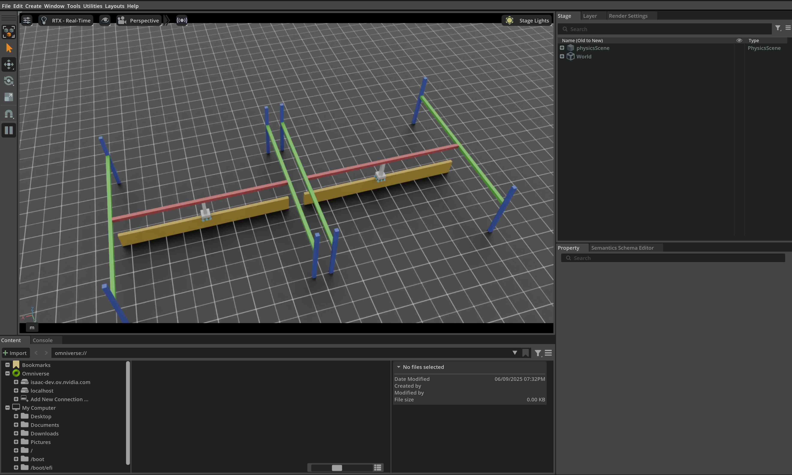

.. _tutorial-interact-surface-gripper:

Interacting with a surface gripper
==================================

.. currentmodule:: isaaclab

This tutorial shows how to interact with an articulated robot with a surface gripper attached to its end-effector in
the simulation. It is a continuation of the :ref:`tutorial-interact-articulation` tutorial, where we learned how to
interact with an articulated robot. Note that as of IsaacSim 5.0 the surface gripper are only supported on the cpu
backend.

The Code
~~~~~~~~

The tutorial corresponds to the ``run_surface_gripper.py`` script in the ``scripts/tutorials/01_assets``
directory.

.. dropdown:: Code for run_surface_gripper.py
   :icon: code

   .. literalinclude:: ../../../../scripts/tutorials/01_assets/run_surface_gripper.py
      :language: python
      :emphasize-lines: 61-85, 124-125, 128-142, 147-150
      :linenos:

The Code Explained
~~~~~~~~~~~~~~~~~~

Designing the scene
-------------------

Similarly to the previous tutorial, we populate the scene with a ground plane and a distant light. Then, we spawn
an articulation from its USD file. This time a pick-and-place robot is spawned. The pick-and-place robot is a simple
robot with 3 driven axes, its gantry allows it to move along the x and y axes, as well as up and down along the z-axis.
Furthermore, the robot end-effector is outfitted with a surface gripper.
The USD file for the pick-and-place robot contains the robot's geometry, joints, and other physical properties
as well as the surface gripper. Before implementing a similar gripper on your own robot, we recommend to
check out the USD file for the gripper found on Isaaclab's Nucleus.

For the pick-and-place robot, we use its pre-defined configuration object, you can find out more about it in the
:ref:`how-to-write-articulation-config` tutorial. For the surface gripper, we also need to create a configuration
object. This is done by instantiating a :class:`assets.SurfaceGripperCfg` object and passing it the relevant
parameters.

The available parameters are:

- ``max_grip_distance``: The maximum distance at which the gripper can grasp an object.
- ``shear_force_limit``: The maximum force the gripper can exert in the direction perpendicular to the gripper's axis.
- ``coaxial_force_limit``: The maximum force the gripper can exert in the direction of the gripper's axis.
- ``retry_interval``: The time the gripper will stay in a grasping state.

As seen in the previous tutorial, we can spawn the articulation into the scene in a similar fashion by creating
an instance of the :class:`assets.Articulation` class by passing the configuration object to its constructor. The same
principle applies to the surface gripper. By passing the configuration object to the :class:`assets.SurfaceGripper`
constructor, the surface gripper is created and can be added to the scene. In practice, the object will only be
initialized when the play button is pressed.

.. literalinclude:: ../../../../scripts/tutorials/01_assets/run_surface_gripper.py
   :language: python
   :start-at: # Create separate groups called "Origin1", "Origin2"
   :end-at: surface_gripper = SurfaceGripper(cfg=surface_gripper_cfg)

Running the simulation loop
---------------------------

Continuing from the previous tutorial, we reset the simulation at regular intervals, set commands to the articulation,
step the simulation, and update the articulation's internal buffers.

Resetting the simulation
""""""""""""""""""""""""

To reset the surface gripper, we only need to call the :meth:`SurfaceGripper.reset` method which will reset the
internal buffers and caches.

.. literalinclude:: ../../../../scripts/tutorials/01_assets/run_surface_gripper.py
   :language: python
   :start-at: # Opens the gripper and makes sure the gripper is in the open state
   :end-at: surface_gripper.reset()

Stepping the simulation
"""""""""""""""""""""""

Applying commands to the surface gripper involves two steps:

1. *Setting the desired commands*: This sets the desired gripper commands (Open, Close, or Idle).
2. *Writing the data to the simulation*: Based on the surface gripper's configuration, this step handles writes the
   converted values to the PhysX buffer.

In this tutorial, we use a random command to set the gripper's command. The gripper behavior is as follows:

- -1 < command < -0.3 --> Gripper is Opening
- -0.3 < command < 0.3 --> Gripper is Idle
- 0.3 < command < 1 --> Gripper is Closing

At every step, we randomly sample commands and set them to the gripper by calling the
:meth:`SurfaceGripper.set_grippers_command` method. After setting the commands, we call the
:meth:`SurfaceGripper.write_data_to_sim` method to write the data to the PhysX buffer. Finally, we step
the simulation.

.. literalinclude:: ../../../../scripts/tutorials/01_assets/run_surface_gripper.py
   :language: python
   :start-at: # Sample a random command between -1 and 1.
   :end-at: surface_gripper.write_data_to_sim()

Updating the state
""""""""""""""""""

To know the current state of the surface gripper, we can query the :meth:`assets.SurfaceGripper.state` property.
This property returns a tensor of size ``[num_envs]`` where each element is either ``-1``, ``0``, or ``1``
corresponding to the gripper state. This property is updated every time the :meth:`assets.SurfaceGripper.update` method
is called.

- ``-1`` --> Gripper is Open
- ``0`` --> Gripper is Closing
- ``1`` --> Gripper is Closed

.. literalinclude:: ../../../../scripts/tutorials/01_assets/run_surface_gripper.py
   :language: python
   :start-at: # Read the gripper state from the simulation
   :end-at: surface_gripper_state = surface_gripper.state

The Code Execution
~~~~~~~~~~~~~~~~~~

To run the code and see the results, let's run the script from the terminal:

.. code-block:: bash

   ./isaaclab.sh -p scripts/tutorials/01_assets/run_surface_gripper.py --device cpu

This command should open a stage with a ground plane, lights, and two pick-and-place robots.
In the terminal, you should see the gripper state and the command being printed.
To stop the simulation, you can either close the window, or press ``Ctrl+C`` in the terminal.

In this tutorial, we learned how to create and interact with a surface gripper. We saw how to set commands and
query the gripper state. We also saw how to update its buffers to read the latest state from the simulation.

In addition to this tutorial, we also provide a few other scripts that spawn different robots. These are included
in the ``scripts/demos`` directory. You can run these scripts as:

.. code-block:: bash

   # Spawn many pick-and-place robots and perform a pick-and-place task
   ./isaaclab.sh -p scripts/demos/pick_and_place.py

Note that in practice, the users would be expected to register their :class:`assets.SurfaceGripper` instances inside
a :class:`isaaclab.InteractiveScene` object, which will automatically handle the calls to the
:meth:`assets.SurfaceGripper.write_data_to_sim` and :meth:`assets.SurfaceGripper.update` methods.

.. code-block:: python

   # Create a scene
   scene = InteractiveScene()

   # Register the surface gripper
   scene.surface_grippers["gripper"] = surface_gripper
