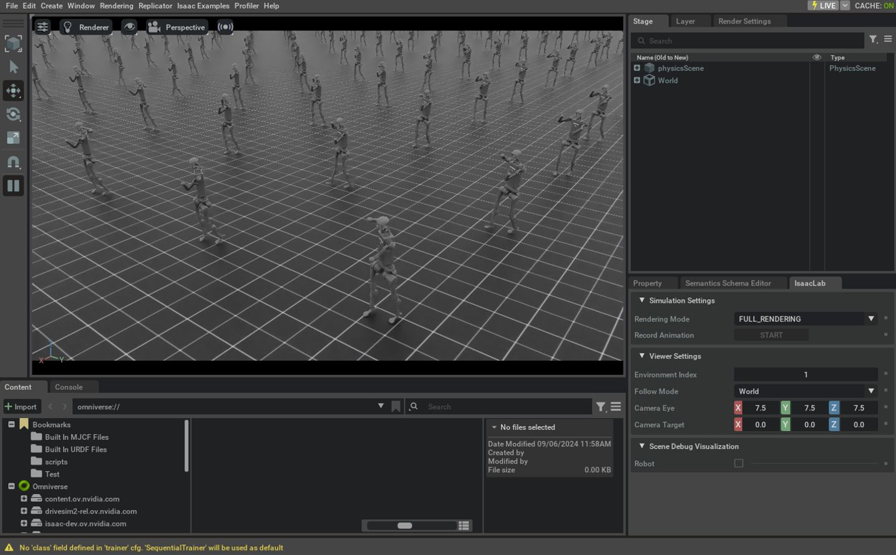

.. _tutorial-modify-direct-rl-env:

Modifying an existing Direct RL Environment
===========================================

.. currentmodule:: isaaclab

Having learnt how to create a task in :ref:`tutorial-create-direct-rl-env`, register it in :ref:`tutorial-register-rl-env-gym`,
and train it in :ref:`tutorial-run-rl-training`, we will now look at how to make minor modifications to an existing task.

Sometimes it is necessary to create, due to complexity or variations from existing examples, tasks from scratch. However, in certain situations,
it is possible to start from the existing code and introduce minor changes, one by one, to transform them according to our needs.

In this tutorial, we will make minor modifications to the direct workflow Humanoid task to change the simple
humanoid model to the Unitree H1 humanoid robot without affecting the original code.

The Base Code
~~~~~~~~~~~~~

For this tutorial, we start from the direct workflow Humanoid environment defined in ``isaaclab_tasks.direct.humanoid`` module.

.. dropdown:: Code for humanoid_env.py
   :icon: code

   .. literalinclude:: ../../../../source/isaaclab_tasks/isaaclab_tasks/direct/humanoid/humanoid_env.py
      :language: python
      :linenos:

The Changes Explained
~~~~~~~~~~~~~~~~~~~~~

Duplicating the file and registering a new task
-----------------------------------------------

To avoid modifying the code of the existing task, we will make a copy of the file containing the Python
code and perform the modification on this copy. Then, in the Isaac Lab project
``source/isaaclab_tasks/isaaclab_tasks/direct/humanoid``
folder we make a copy of the ``humanoid_env.py`` file and rename it to ``h1_env.py``.

Open the ``h1_env.py`` file in a code editor and replace all the humanoid task name (``HumanoidEnv``) and its configuration
(``HumanoidEnvCfg``) instances to ``H1Env`` and ``H1EnvCfg`` respectively.
This is necessary to avoid name conflicts during import when registering the environment.

Once the name change has been made, we proceed to add a new entry to register the task under the name ``Isaac-H1-Direct-v0``.
To do this, we modify the ``__init__.py`` file in the same working folder and add the following entry.
Refer to the :ref:`tutorial-register-rl-env-gym` tutorial for more details about environment registrations.

.. hint::

   If the changes in the task are minimal, it is very likely that the same RL library agent configurations can be used to train it successfully.
   Otherwise, it is advisable to create new configuration files (adjusting their name during registration under the ``kwargs`` parameter)
   to avoid altering the original configurations.

.. literalinclude:: ../../refs/snippets/tutorial_modify_direct_rl_env.py
   :language: python
   :start-after: [start-init-import]
   :end-before: [end-init-import]

.. literalinclude:: ../../refs/snippets/tutorial_modify_direct_rl_env.py
   :language: python
   :start-after: [start-init-register]
   :end-before: [end-init-register]

Changing the robot
------------------

The ``H1EnvCfg`` class (in the new created ``h1_env.py`` file) encapsulates the configuration values of the environment,
including the assets to be instantiated. Particularly in this example, the ``robot`` property holds the target articulation configuration.

Since the Unitree H1 robot is included in the Isaac Lab assets extension (``isaaclab_assets``) we can just import it
and do the replacement directly (under the ``H1EnvCfg.robot`` property), as shown below. Note that we also need to modify the
``joint_gears`` property as it holds robot-specific configuration values.

.. |franka-direct-link| replace:: `Isaac-Franka-Cabinet-Direct-v0 <https://github.com/isaac-sim/IsaacLab/blob/main/source/isaaclab_tasks/isaaclab_tasks/direct/franka_cabinet/franka_cabinet_env.py>`__

.. hint::

   If the target robot is not included in the Isaac Lab assets extension, it is possible to load and configure it, from a USD file,
   by using the :class:`~isaaclab.assets.ArticulationCfg` class.

   * See the |franka-direct-link| source code for an example of loading and configuring a robot from a USD file.
   * Refer to the `Importing a New Asset <../../how-to/import_new_asset.html>`_ tutorial for details on how to import an asset from URDF or MJCF file, and other formats.

.. literalinclude:: ../../refs/snippets/tutorial_modify_direct_rl_env.py
   :language: python
   :start-after: [start-h1_env-import]
   :end-before: [end-h1_env-import]

.. literalinclude:: ../../refs/snippets/tutorial_modify_direct_rl_env.py
   :language: python
   :start-after: [start-h1_env-robot]
   :end-before: [end-h1_env-robot]

The robot changed, and with it the number of joints to control or the number of rigid bodies that compose the articulation, for example.
Therefore, it is also necessary to adjust other values in the environment configuration that depend on the characteristics of the robot,
such as the number of elements in the observation and action space.

.. literalinclude:: ../../refs/snippets/tutorial_modify_direct_rl_env.py
   :language: python
   :start-after: [start-h1_env-spaces]
   :end-before: [end-h1_env-spaces]

The Code Execution
~~~~~~~~~~~~~~~~~~

After the minor modification has been done, and similar to the previous tutorial, we can train on the task using one of the available RL workflows for such task.

.. code-block:: bash

  ./isaaclab.sh -p scripts/reinforcement_learning/rl_games/train.py --task Isaac-H1-Direct-v0 --headless

When the training is finished, we can visualize the result with the following command.
To stop the simulation, you can either close the window, or press ``Ctrl+C`` in the terminal
where you started the simulation.

.. code-block:: bash

  ./isaaclab.sh -p scripts/reinforcement_learning/rl_games/play.py --task Isaac-H1-Direct-v0 --num_envs 64

In this tutorial, we learnt how to make minor modifications to an existing environment without affecting the original code.

It is important to note, however, that while the changes to be made may be small, they may not always work on the first try,
as there may be deeper dependencies on the original assets in the environment being modified.
In these cases, it is advisable to analyze the code of the available examples in detail in order to make an appropriate adjustment.
