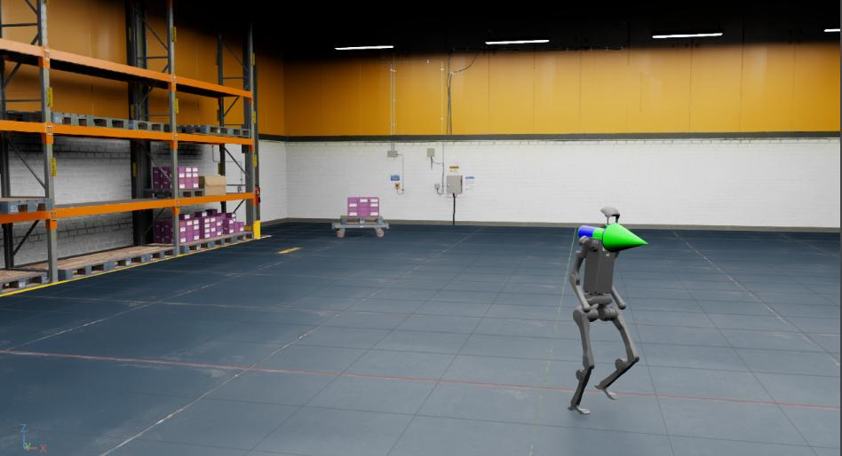

.. _tutorial-policy-inference-in-usd:

Policy Inference in USD Environment
===================================

.. currentmodule:: isaaclab

Having learnt how to modify a task in :ref:`tutorial-modify-direct-rl-env`, we will now look at how to run a trained policy in a prebuilt USD scene.

In this tutorial, we will use the RSL RL library and the trained policy from the Humanoid Rough Terrain ``Isaac-Velocity-Rough-H1-v0`` task in a simple warehouse USD.

The Tutorial Code
~~~~~~~~~~~~~~~~~

For this tutorial, we use the trained policy's checkpoint exported as jit (which is an offline version of the policy).

The ``H1RoughEnvCfg_PLAY`` cfg encapsulates the configuration values of the inference environment, including the assets to
be instantiated.

In order to use a prebuilt USD environment instead of the terrain generator specified, we make the
following changes to the config before passing it to the ``ManagerBasedRLEnv``.

.. dropdown:: Code for policy_inference_in_usd.py
   :icon: code

   .. literalinclude:: ../../../../scripts/tutorials/03_envs/policy_inference_in_usd.py
      :language: python
      :linenos:
      :emphasize-lines: 60-69

Note that we have set the device to ``CPU`` and disabled the use of Fabric for inferencing.
This is because when simulating a small number of environment, CPU simulation can often perform faster than GPU simulation.

The Code Execution
~~~~~~~~~~~~~~~~~~

First, we need to train the ``Isaac-Velocity-Rough-H1-v0`` task by running the following:

.. code-block:: bash

  ./isaaclab.sh -p scripts/reinforcement_learning/rsl_rl/train.py --task Isaac-Velocity-Rough-H1-v0 --headless

When the training is finished, we can visualize the result with the following command.
To stop the simulation, you can either close the window, or press ``Ctrl+C`` in the terminal
where you started the simulation.

.. code-block:: bash

  ./isaaclab.sh -p scripts/reinforcement_learning/rsl_rl/play.py --task Isaac-Velocity-Rough-H1-v0 --num_envs 64 --checkpoint logs/rsl_rl/h1_rough/EXPERIMENT_NAME/POLICY_FILE.pt

After running the play script, the policy will be exported to jit and onnx files under the experiment logs directory.
Note that not all learning libraries support exporting the policy to a jit or onnx file.
For libraries that don't currently support this functionality, please refer to the corresponding ``play.py`` script for the library
to learn about how to initialize the policy.

We can then load the warehouse asset and run inference on the H1 robot using the exported jit policy.

.. code-block:: bash

  ./isaaclab.sh -p scripts/tutorials/03_envs/policy_inference_in_usd.py --checkpoint logs/rsl_rl/h1_rough/EXPERIMENT_NAME/exported/policy.pt

In this tutorial, we learnt how to make minor modifications to an existing environment config to run policy inference in a prebuilt usd environment.
