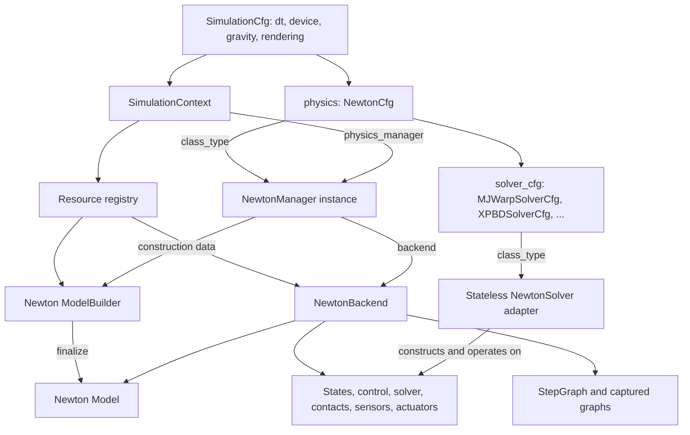

# Newton manager design

`SimulationContext` remains Isaac Lab's scene-level coordinator. It constructs or
accepts a physics manager and delegates physics to it. For Newton, that manager
connects Isaac Lab's lifecycle to an explicit `NewtonBackend`; stateless solver
adapters and backend functions implement the simulation.

This document describes the implemented design. Examples marked **application
stub** leave task-specific scene/controller code to the application; all surrounding
configuration, lifecycle and API calls show the intended integration.

The companion [configuration and API reference](newton-manager-api.md) lists every
Newton configuration field, public manager/backend call, solver extension hook and
runtime record, with defaults, usage and recipes for callbacks, sensors and resets.

## The pieces and their relationships



| Component | Responsibility and lifetime |
| --- | --- |
| `SimulationContext` | Stage, settings, clone contexts, resource registry, rendering/visualizers, and the attached manager. Lives for the Isaac Lab scene/session. |
| `NewtonManager` | Builder access, backend lifecycle, callbacks, views, site requests, replication metadata, control bindings and decimation. Retains construction inputs across hard resets. |
| `NewtonBackend` | One finalized model and its simulation data: states, control, native solver, contacts, collision pipeline, sensors, actuators, dirty masks, scratch and step graph. Replaced on hard reset. |
| `NewtonSolver` adapter | Stateless hooks for construction, capabilities, stepping, reset and forward kinematics. Each call receives the relevant backend/model/configuration. |
| `StepGraph` | Ordered operations bound to one backend's buffers; captures graphable segments and executes eager segments in order. Rebuilt when the schedule changes. |

The manager is lightweight because numerical work, buffer ownership and scheduling
live in the backend layer. It retains the Isaac Lab integration responsibilities
needed by assets, sensors and callers. The native solver instance lives in
`backend.solver`; its adapter class lives in `backend.solver_adapter`.

Within the backend, `model` stores topology and physical properties, `state_0`
stores the current simulation state, `state_1` provides a second buffer when the
solver needs one, and `control` stores solver inputs. The backend groups these
objects with their lifetime-dependent consumers and graphs. Its functional API
therefore receives one explicit object without looking up a global simulation.
Other physics engines can also request a render-only Newton model through the
registry; that backend has no Newton simulation solver or stepping schedule.

## Configuration: what is NewtonCfg?

`NewtonCfg` is the Newton implementation of Isaac Lab's `PhysicsCfg`. It is stored
in `SimulationCfg.physics` and describes how to construct and run Newton physics.
It contains configuration rather than live models, GPU state or a solver instance.

| Configuration | What belongs here |
| --- | --- |
| `SimulationCfg` | Physics timestep `dt`, device, gravity, rendering interval and the selected `physics` configuration. |
| `NewtonCfg` | Integration-manager `class_type`, `solver_cfg`, `num_substeps`, collision settings, `use_cuda_graph`, determinism and shape defaults. Defaults to `NewtonManager` with `MJWarpSolverCfg`. |
| `NewtonSolverCfg` subclass | Solver-adapter `class_type` and solver-specific settings, such as MJWarp iterations and contact capacity. |
| `NewtonBuilderCfg` | Internal registry construction descriptor: selected physics configuration and owning manager. Produces the shared mutable `ModelBuilder`. |
| `NewtonBackendCfg` | Internal registry resource descriptor: physics configuration, device and owning manager. Produces a finalized `NewtonBackend`. |

The two `class_type` fields are independent: changing the solver does not replace
a custom manager. Builder/backend descriptors include the owner so independently
owned models cannot accidentally share a registry entry. Equal descriptors of the
same type share a resource within a context; registered configurations are treated
as read-only. Applications normally set `SimulationCfg` and `NewtonCfg`, while the
manager/cloner construct the registry descriptors.

## SimulationContext and the normal Isaac Lab path

`SimulationContext(cfg)` resolves `cfg.physics`, prepares the USD stage, selects
the device, constructs `cfg.physics.class_type()` and calls
`manager.initialize(sim)`. Initialization attaches the manager and supplies the
context's configuration, device and timestep. It does not yet finalize the model.

Scene creation/cloning populates the shared builder. Assets and sensors register
lifecycle callbacks on their owning manager. `sim.reset()` then builds physics,
initializes visualizers/render consumers and starts the timeline. `sim.step()`
handles timeline state, delegates to `sim.physics_manager.step()`, and optionally
renders. Scene publication exposes physics data to rendering at its own cadence.

```python
from isaaclab.sim import SimulationCfg, SimulationContext
from isaaclab_newton.physics import MJWarpSolverCfg, NewtonCfg


def build_scene(sim):
    """Application stub: create an InteractiveScene and its assets/sensors.

    Use the ordinary scene/cloning path so it populates this context's shared
    builder. Return an object with write_data_to_sim() and update(dt).
    """
    raise NotImplementedError("Supply the task's scene configuration here")


cfg = SimulationCfg(
    dt=0.01,
    device="cuda:0",
    gravity=(0.0, 0.0, -9.81),
    physics=NewtonCfg(
        solver_cfg=MJWarpSolverCfg(iterations=20),
        num_substeps=2,
        use_cuda_graph=True,
    ),
)
sim = SimulationContext(cfg)
try:
    scene = build_scene(sim)
    sim.reset()                         # Build model, bind consumers, initialize solver.
    manager = sim.physics_manager       # The NewtonManager instance.
    backend = manager.backend          # The finalized NewtonBackend.
    for _ in range(100):
        scene.write_data_to_sim()       # Manual scene loop: submit commands here.
        sim.step(render=False)          # Advance physics through the manager.
        scene.update(dt=cfg.dt)         # Publish the resulting scene state.
finally:
    SimulationContext.clear_instance() # Close manager, render resources and stage.
```

For a manager-based environment, Isaac Lab additionally calls
`manager.bind_control(action_manager, scene)` and `manager.set_decimation(...)`.
Action application, controllers and asset command writers then run inside the
physics schedule; the environment skips their duplicate host execution. When the
manager handles decimation, one `sim.step(render=False)` advances all physics ticks
for that policy step. Consumers requiring intermediate scene publication can keep
decimation in the environment.

```text
ManagerBasedRLEnv.step(action)
  process_action(action)                     # Prepare policy inputs.
  SimulationContext.step(render=False)
    NewtonManager.step()                    # Lifecycle/time integration.
      newton_backend.step(manager.backend)  # Forward changes, replay StepGraph.
        [CONTROL → actuators → solver → native sensors] × decimation
  scene.update(elapsed_physics_dt)
  terminations, rewards, masked resets, commands, observations
```

This is the ordinary host entry point. Capturing the physics schedule does not
implicitly capture rendering, Python bookkeeping or the whole RL environment.
An outer device runner composes additional graph-safe work with `record_step()`.

## Construction, reset and cleanup

1. The cloner/consumers obtain the shared `ModelBuilder` through
   `sim.get_or_create_backend(NewtonBuilderCfg(...))` and author scene data.
2. A hard `manager.reset()` closes the old backend and dispatches `MODEL_INIT`.
   Consumers finish authoring construction data and requested attributes.
3. The context obtains `NewtonBackendCfg(...)` through its registry. Its factory
   calls `manager.finalize_backend()`: prepare sites and solver-specific builder
   settings, finalize the model, and allocate backend state/control buffers.
4. `PHYSICS_READY` binds views, sensors, actuators and callbacks to the new buffers.
   Consumers can author model properties before the native solver is constructed.
5. `init_solver(backend)` constructs the solver and contacts and initializes body
   state. Control bindings and decimation are resolved; physics has not advanced.
6. The first ordinary `step()` runs eagerly for lazy initialization, then captures
   the prepared schedule without advancing physics a second time.

A soft reset keeps the backend. An episode reset writes selected worlds' state
and invalidates their derived data; it does not rebuild the model. A hard reset
invalidates captured graphs and views bound to old buffers, while retaining builder
inputs and site requests without injecting duplicate sites.

The context registry owns registered resource lifetimes. The manager requests
release through `sim.close_backend(backend)`; standalone managers close directly.
`SimulationContext.clear_instance()` stops consumers, closes physics and rendering
resources, and tears down the stage. Closing one standalone manager does not clear
another manager's state or callbacks.

## Public manager API and downstream extension

| API | Contract |
| --- | --- |
| `reset(soft=False)` | Build and initialize without advancing physics; soft reset retains the backend. |
| `prepare()` | Commit pending changes and allocate the schedule/scratch without advancing physics. |
| `step()` | Advance configured physics steps and update host bookkeeping. |
| `record_step()` | Record device work into an outer capture without host time updates. |
| `forward()` | Commit pending state/model changes without advancing physics. |
| `register_step_callback(fn, phase, graphable=True)` | Add work at a phase and invalidate the compiled schedule; returns a handle for `unregister_step_callback`. |
| `finalize_backend()` | Override model/backend construction; used by both context and standalone paths. |
| `close()` | Release this manager's resources and callbacks. |

For custom integration, subclass `NewtonManager`, preserve the base lifecycle,
and select it through the physics configuration. The example below uses a reset
extension to bind custom device work to each newly allocated backend:

It reuses the `build_scene` application stub from the context example above.

```python
from isaaclab.sim import SimulationCfg, SimulationContext
from isaaclab_newton.physics import NewtonCfg, NewtonManager, StepPhase


def make_controller(backend):
    """Application stub: allocate persistent inputs/scratch, then return a callable.

    The callable reads live backend state and writes backend.control using
    capture-safe device operations. Initialize everything before recording.
    """
    raise NotImplementedError("Supply the controller implementation here")


class MyNewtonManager(NewtonManager):
    def reset(self, soft=False):
        super().reset(soft)
        if not soft:
            controller = make_controller(self.backend)
            self.register_step_callback(
                controller, StepPhase.CONTROL, graphable=True, name="my_controller"
            )


cfg = SimulationCfg(physics=NewtonCfg(class_type=MyNewtonManager))
sim = SimulationContext(cfg)  # Constructs MyNewtonManager() without arguments.
try:
    scene = build_scene(sim)
    sim.reset()
    sim.step(render=False)
    scene.update(dt=cfg.dt)
finally:
    SimulationContext.clear_instance()

# Alternative for applications that construct the manager themselves:
my_manager = MyNewtonManager()
sim = SimulationContext(cfg, physics_manager=my_manager)
try:
    assert sim.physics_manager is my_manager
    scene = build_scene(sim)
    sim.reset()
    sim.step(render=False)
    scene.update(dt=cfg.dt)
finally:
    SimulationContext.clear_instance()
```

The context owns an injected manager's lifecycle and supplies its simulation
settings. An already attached manager cannot be injected again. For specialized
construction, override `finalize_backend()` and return a `NewtonBackend`; call the
base implementation when retaining standard builder finalization. A new numerical
solver instead subclasses `NewtonSolver` and is selected through
`solver_cfg.class_type`, leaving the integration manager unchanged.

## Two independent managers

`SimulationContext` remains the scene-level singleton. Independent simulations use
standalone managers or the functional API; neither requires a context. This example
builds two small pendulums with independent models, states and callbacks:

```python
import warp as wp
from isaaclab_newton.physics import NewtonCfg, NewtonManager


def make_builder(cfg):
    builder = cfg.solver_cfg.class_type.create_builder(physics_cfg=cfg)
    builder.begin_world()
    link = builder.add_link(mass=1.0, inertia=wp.diag(wp.vec3(0.01)))
    joint = builder.add_joint_revolute(
        parent=-1,
        child=link,
        axis=(0.0, 1.0, 0.0),
        parent_xform=wp.transform(wp.vec3(0.0, 0.0, 2.0), wp.quat_identity()),
        child_xform=wp.transform(wp.vec3(0.0, 0.0, 0.5), wp.quat_identity()),
    )
    builder.joint_q[-1] = 0.2
    builder.add_articulation([joint])
    builder.end_world()
    return builder


left_cfg, right_cfg = NewtonCfg(), NewtonCfg()
left = NewtonManager(make_builder(left_cfg), left_cfg, dt=0.01, device="cuda:0")
right = NewtonManager(make_builder(right_cfg), right_cfg, dt=0.01, device="cuda:0")
try:
    left.reset()
    right.reset()
    assert left.backend is not right.backend
    for _ in range(100):
        left.step()
        right.step()
finally:
    left.close()
    right.close()
```

## Low-level API and outer capture

`NewtonBackend` also works without a manager. The caller finalizes the model,
initializes the solver, binds consumers, prepares the schedule and owns cleanup.
The module functions take the backend explicitly and read no active manager.

The following continues with `make_builder` from the pendulum example and records
two backends into one CUDA graph:

```python
from isaaclab_newton.physics import NewtonBackend, NewtonCfg
from isaaclab_newton.physics import newton_backend as nb


def make_backend():
    cfg = NewtonCfg()
    builder = make_builder(cfg)
    cfg.solver_cfg.class_type.prepare_solver_builder(builder, cfg.solver_cfg)
    model = builder.finalize(device="cuda:0")
    backend = NewtonBackend(model, cfg, dt=0.01)
    nb.init_solver(backend)
    backend.steps_per_call = 2
    # Register controllers/sensors here, with buffers initialized before prepare.
    nb.prepare(backend)
    return backend


backends = []
try:
    backends.append(make_backend())
    backends.append(make_backend())

    def advance_both():
        for backend in backends:
            nb.record_step(backend)

    graph = nb.capture_graph("cuda:0", advance_both)
    for _ in range(100):
        graph.launch()  # Each backend advances two ticks; no Python step callbacks replay.
finally:
    for backend in backends:
        backend.close()
```

`prepare` allocates schedule scratch without a warmup physics step. Callbacks must
be ready for capture. `record_step` rejects eager operations or unsupported solvers
before executing work. `capture_graph` coordinates Torch and Warp on one stream
and retains both allocation lifetimes, including conditional-node scratch. Rebuild
an outer graph after changing callbacks, step count or any referenced buffers.
Host simulation-time bookkeeping remains the outer runner's responsibility.

## Inside the simulation step

`StepGraph` flattens decimation and solver substeps into bound operations:

```text
each physics step:
  solver preparation → collision → CONTROL → Newton actuators
  → POST_ACTUATOR (final physics step only)
  each substep: staged forces → STATE_FORCE → solver
  → normalize output into stable state_0 → POST_STEP → native sensors
after decimation: normalize actuator history → clear forces
```

Configured collision refreshes also run between substeps. `CONTROL` contains the
ordinary action/controller and command-writing paths in their existing order.
`STATE_FORCE` callbacks receive the substep input state. Native contact and IMU
updates run every physics tick, keeping feedback current within decimation.

Consecutive graphable operations form captured segments. A fully graphable
schedule becomes one captured simulation step; eager operations retain their exact
position between segments. Action terms and actuators opt in through
`supports_graph_capture`. Implementations with changing Python history, host
synchronization or dynamic shapes stay eager and cannot join a fully captured outer
step. Device input buffers, including wrench buffers, remain live across replays.

State writes use `invalidate_worlds`/`invalidate_fk` followed by `forward` or `step`.
Property writes call `mark_model_changed(backend, flags, env_mask)`; the next boundary
combines pending categories into one solver refresh. CUDA conditional execution
skips empty masks without host synchronization. Property-changing resets inside
an outer graph require `capture_graph` to retain their scratch storage.

Startup work is reduced through one initialization pass and lazy scratch allocation.
Runtime work is reduced through cached schedules, captured control/decimation,
stable buffers and combined property refreshes. Single-state solvers avoid redundant
state buffers. Derived-state reads recompute during stepping/capture; finite-difference
accelerations retain scene-publication cadence.

See the [solver extension guide](../../../docs/source/developer-tools/extending_newton_solvers.rst)
for detailed hook contracts and coupling, the
[SimulationContext implementation](../../isaaclab/isaaclab/sim/simulation_context.py)
for registry/lifecycle ownership, and the
[functional implementation](../isaaclab_newton/physics/newton_backend.py)
for scheduling and capture internals.
