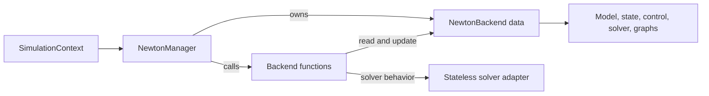

# Newton manager: from scene setup to simulation

The Newton manager connects an Isaac Lab scene to Newton physics. You build your
scene, choose a solver, and use `SimulationContext` to initialize and step it.
The manager brings controllers, actuators and physics into the same execution
schedule, so a compatible simulation can run as a captured CUDA graph.

The design also supports applications that need more control. You can run two
independent managers, add device work to the simulation step, or supply your own
manager to Isaac Lab. All of these paths use the same simulation backend.

For the architectural direction, start with [data and operations](#explicit-data-and-operations).
For everyday usage, start with the [scene example](#start-with-a-scene), then follow the
[lifecycle](#what-happens-during-initialization) and
[simulation step](#what-runs-inside-a-step). The companion
[extension examples](newton-manager-api.md) cover custom managers and outer capture.

## How the pieces fit together

`SimulationContext` remains the entry point for an Isaac Lab scene. It owns the
stage, coordinates rendering and cleanup, and delegates physics to its manager.



| Component | What you use it for |
| --- | --- |
| `SimulationContext` | Initialize, step and render the scene; coordinate resource cleanup. |
| `NewtonCfg` | Choose the solver and Newton settings through `SimulationCfg.physics`. |
| `NewtonManager` | Connect scene construction, assets, sensors and callbacks to physics. |
| `NewtonBackend` | Hold one simulation's model, states, control inputs, solver, contacts and graph. |
| Solver adapter | Teach the backend how to construct, step and reset a particular Newton solver. |

The manager stays small by delegating numerical work and graph scheduling to the
backend layer. Each manager owns its simulation state and callbacks. Assets and
sensors retain their manager, so one manager's cleanup cannot clear another's data.

## Explicit data and operations

The architectural direction is to keep **simulation data, numerical operations and
Isaac Lab integration** separately understandable:

- **Data lives in `NewtonBackend`.** The model, state arrays, control inputs,
  solver instance and captured graphs belong to one simulation. Buffers keep
  stable identities between hard resets while their contents change during stepping.
- **Operations take that backend explicitly.** Functions such as `init_solver`,
  `forward`, `prepare` and `step` receive the simulation they operate on. They
  mutate its data; they do not look up an active manager or context.
- **The manager connects the lifecycle.** It handles construction, consumer
  binding, time bookkeeping and cleanup, and calls the same backend functions
  available to a custom runner.

Controllers and solver steps operate on persistent arrays. The schedule binds
those arrays when it is built and reuses them during execution.

For example, given a compatible finalized Newton model, a runner can use the functional core
directly. `physics_cfg` is a `NewtonCfg`; the caller supplies the model and timestep:

```python
from isaaclab_newton.physics import NewtonBackend
from isaaclab_newton.physics import newton_backend as nb


def run_physics(model, physics_cfg, dt):
    backend = NewtonBackend(model, physics_cfg, dt=dt)
    try:
        nb.init_solver(backend)
        nb.prepare(backend)
        for _ in range(100):
            nb.step(backend)
    finally:
        backend.close()
```

This is what *functional* means here: dependencies are explicit and mutable state
has an owner. The numerical buffers remain mutable for efficient GPU execution.
Solver adapters follow the same rule: their hooks receive a backend or model,
while each backend owns its native solver instance. Adding a solver therefore
does not require a new integration manager.

## Start with a scene

Most applications configure Newton through `SimulationCfg.physics`.
`SimulationCfg` supplies shared settings such as the timestep, device and gravity.
`NewtonCfg` supplies Newton settings, including solver selection, substeps and
CUDA graph capture. It defaults to `NewtonManager` with the MuJoCo Warp solver.

This example shows the complete lifecycle. Replace `build_scene` with your task's
scene construction; it is the only application-specific stub.

```python
from isaaclab.sim import SimulationCfg, SimulationContext
from isaaclab_newton.physics import MJWarpSolverCfg, NewtonCfg


def build_scene(sim):
    """Application stub: create and return your InteractiveScene.

    Configure its assets and sensors through the usual Isaac Lab scene APIs.
    """
    raise NotImplementedError("Supply your task's scene configuration")


cfg = SimulationCfg(
    dt=0.01,
    device="cuda:0",
    physics=NewtonCfg(
        solver_cfg=MJWarpSolverCfg(iterations=20),
        num_substeps=2,
        use_cuda_graph=True,
    ),
)
sim = SimulationContext(cfg)
try:
    scene = build_scene(sim)
    sim.reset()

    for _ in range(100):
        scene.write_data_to_sim()
        sim.step(render=False)
        scene.update(dt=cfg.dt)
finally:
    SimulationContext.clear_instance()
```

Here, each physics tick lasts `0.01` seconds and contains two solver substeps.
`iterations=20` is an example solver setting; choose settings appropriate to the
solver and task. To switch solvers, replace `MJWarpSolverCfg` with a supported
configuration such as `XPBDSolverCfg`.

In a manager-based environment, Isaac Lab also binds action application and scene
command submission into the Newton step. That workflow handles the calls shown
in the manual scene loop above for you.

## What happens during initialization

The scene begins as construction data and becomes a live simulation when you call
`sim.reset()`:

1. **Create the context.** The context constructs the configured manager and gives
   it the simulation settings. Scene construction and cloning populate a shared
   Newton `ModelBuilder`.
2. **Finalize the model.** The manager dispatches `MODEL_INIT` so consumers can
   finish construction requests, then finalizes the builder into a model and
   creates its `NewtonBackend`.
3. **Bind consumers.** `PHYSICS_READY` lets assets and sensors bind their views,
   buffers, actuators and step callbacks. The native solver is then constructed
   using the model properties those consumers authored.
4. **Prepare to run.** The first ordinary step executes eagerly to initialize lazy
   resources, then captures its schedule. Later steps replay it. Capturing does
   not advance physics a second time.

After initialization, `sim.physics_manager` gives you the manager and
`sim.physics_manager.backend` gives you the live simulation data. The backend's
`model` contains topology and physical properties, `state_0` contains the current
state, and `control` contains solver inputs. It also retains the resources needed
to replay the simulation safely.

Internally, the context's resource registry shares construction data and tracks
cleanup. `NewtonBuilderCfg` describes a builder request; `NewtonBackendCfg`
describes the finalized resource. Normal scene code lets the manager and cloner
create these descriptors.

## What runs inside a step

In a manager-based environment, the policy supplies an action and the physics
schedule applies it over the configured number of physics ticks, called
*decimation*. Each tick follows this order:

```text
Collision detection
  → controllers and command submission
  → actuators
  → forces and solver substeps
  → post-step work and native sensor updates
```

The schedule keeps the ordinary action terms and controller implementations.
Native contact and IMU sensors update every physics tick, so the next controller
update sees current feedback. Double-buffered solvers finish each tick in the
same published `state_0` object.

When all scheduled work supports capture, the simulation schedule replays as one
CUDA graph. Work that depends on changing Python state runs eagerly at its place
in the schedule. Custom action terms and actuators declare capture support through
`supports_graph_capture`; that declaration requires fixed buffers and device work
that can replay without Python decisions.

Rendering, Python bookkeeping and the remaining RL computations keep their own
lifecycle. To capture a larger device pipeline around physics, use the
[outer-capture example](newton-manager-api.md#capture-a-larger-device-step).

## What this architecture enables

**Two managers can run independently.** Give each one its own populated builder;
the builders can describe different scenes and use different solver settings.
This function shows the full ownership boundary, using builders supplied by the
application. The [pendulum example](newton-manager-api.md#run-two-independent-simulations)
includes builder construction.

```python
from isaaclab_newton.physics import NewtonCfg, NewtonManager


def run_pair(builder_a, builder_b):
    left = NewtonManager(builder_a, NewtonCfg(), dt=0.01, device="cuda:0")
    right = NewtonManager(builder_b, NewtonCfg(), dt=0.01, device="cuda:0")
    try:
        left.reset()
        right.reset()
        left.step()   # Advances only the left simulation.
        right.step()
    finally:
        left.close()
        right.close()
```

**The same physics can join a larger graph.** An outer runner can record several
backends, controllers and other graph-safe device operations into one capture.
The [composition example](newton-manager-api.md#compose-two-simulations-in-one-graph)
shows this using the same managers.

**Performance work has a clear home.** Model construction and consumer binding
happen once per hard reset. The backend allocates scratch as needed and caches
its schedule. Graph replay reduces repeated Python dispatch across controllers,
actuators and solver substeps; property edits are combined before solver refresh.
These mechanisms reduce startup and runtime overhead without adding separate
controller implementations for captured execution.

## Resetting and closing

The kind of reset determines which resources remain valid:

| Operation | What changes |
| --- | --- |
| Episode reset | Writes selected environments' state and refreshes derived data; retains the model and backend. |
| `sim.reset(soft=True)` | Retains the physics backend and skips its reconstruction. |
| `sim.reset()` | Rebuilds the backend from retained construction data; consumers rebind to the new buffers. |

A hard reset replaces the buffers referenced by old views and captured graphs.
Register custom bindings through the lifecycle so they are recreated with the
backend. Site requests survive rebuilding without creating duplicate sites.

`SimulationContext.clear_instance()` closes physics, rendering resources and the
stage. A standalone manager uses `manager.close()`. Keep cleanup in a `finally`
block, as shown in the examples.

## Extending the design

Choose the extension point that matches the work:

- **Extra controller or device work:** register a step callback. Ordinary scene
  controllers and actuators are already bound by the manager-based workflow.
- **Custom integration or model construction:** subclass `NewtonManager`, select
  it with `NewtonCfg(class_type=MyManager)`, or inject an instance with
  `SimulationContext(cfg, physics_manager=my_manager)`.
- **A different numerical solver:** provide a `NewtonSolver` adapter and select it
  through `solver_cfg.class_type`.
- **Independent simulations or an outer graph:** use standalone managers or the
  functions in `newton_backend`, which take a backend explicitly.

Manager selection and solver selection are independent. `SimulationContext`
remains the scene-level singleton; standalone managers can coexist without it.

See the [extension examples](newton-manager-api.md) for complete setup and cleanup,
and the [solver extension guide](../../../docs/source/developer-tools/extending_newton_solvers.rst)
for detailed hook contracts and coupling. The
[implementation](../isaaclab_newton/physics/newton_backend.py) contains the scheduling
and capture details.
