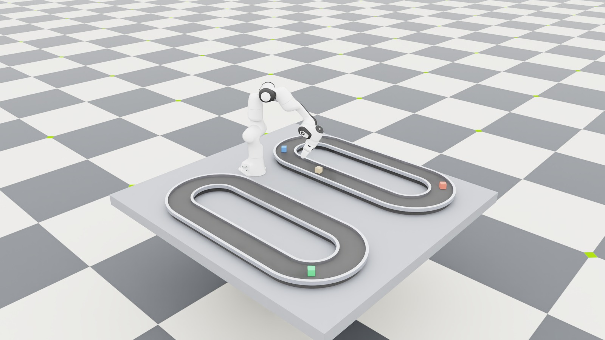

# Conveyor racetrack transfer

A Franka continuously transfers four numbered 40 mm cubes between two counter-rotating
racetrack conveyors. The trained policy uses 123 observations and eight actions at 60 Hz,
with 120 Hz physics and a 0.35 m/s belt speed.



## Backend support

The racetrack task runs on Newton GPU. `IsaacContrib-Conveyor-Racetrack-Transfer-PhysX-CPU-v0` provides a CPU-only
native PhysX reference for the original four-cube racetrack task.

The PhysX task rejects CUDA during configuration validation. In the supported Isaac Sim runtime,
enabling the native surface-velocity contact-modification path under GPU dynamics can drop the belt
contacts and let packages pass through the conveyor. CPU PhysX preserves those contacts. Use the
Newton task whenever GPU simulation or vectorized throughput is required.

The two backends deliberately share the policy tensor contract, so an RSL-RL checkpoint can be
loaded by either task without reshaping or reordering tensors. Their contact and actuator dynamics
are not numerically identical; validate task behavior when transferring a policy between them.

Surface-velocity intent and the tensorized control contract live in
`isaaclab_contrib.conveyors.surface_velocity`. Newton traction uses the complete upstream
`ConveyorForceModel` from the pinned Newton release, including its MuJoCo contact reporting.
`isaaclab_contrib.conveyors.newton` adapts replicated surfaces, parcel selection, controls, and
reset lifecycle; it contains no separate traction solver.
PhysX schema authoring and live attribute control live in `isaaclab_contrib.conveyors.physx`.
The task package owns only the racetrack geometry, backend lifecycle selection, and task-level commands.

## Original racetrack task

Newton is kitless and supports the lightweight GL viewer:

```bash
DISPLAY=:1 uv run isaaclab play --rl_library rsl_rl \
  --task IsaacContrib-Conveyor-Racetrack-Transfer-v0 \
  --checkpoint pretrained \
  --num_envs 8 --device cuda:0 --viz newton_gl --real-time
```

The `pretrained` selector downloads the RSL-RL policy published specifically for the Newton MJWarp
backend. The Newton checkpoint is published on Isaac Dev. While the public mirror is syncing,
use a local checkpoint path if the download is unavailable.
The PhysX task resolves a different backend-specific artifact name, so transferring this Newton policy
to PhysX currently requires the explicit local checkpoint path shown below.

Training uses the same task ID and defaults to 256 environments:

```bash
uv run isaaclab train --rl_library rsl_rl \
  --task IsaacContrib-Conveyor-Racetrack-Transfer-v0 \
  --num_envs 256 --device cuda:0
```

### Curriculum and evaluation

Racetrack training samples physically calibrated resets from release through moving-belt pickup.
The shared `SuccessMonitorCfg` tracks **phase progress** per reset row and weights intermediate
variants around a 50% progress target; this is not the full-transfer success rate. Sampling remains
balanced across phases, cube identities, and directions. Moving-belt starts receive at least 35%
of resets, increasing toward 90% only when completed transfers from those starts and reset-row
coverage improve. `deployment_transfer_success_rate` reports that separate rolling signal.

New RSL-RL checkpoints save the curriculum evidence alongside standard PPO state and restore it
with `--checkpoint /path/to/model.pt`. Older checkpoints load normally with fresh evidence;
loading actor weights alone leaves the current curriculum intact. Playback disables the curriculum.

Evaluate from home on moving belts, with fixed reset settings and a chosen seed:

```bash
uv run python -m isaaclab_tasks.contrib.conveyor_franka.evaluate \
  --checkpoint /path/to/model.pt --num_envs 8 --device cuda:0 \
  --steps 3600 --seed 0 --output /tmp/conveyor-evaluation.json
```

The report counts completed transfers in both directions, safety failures, non-finite observations,
and transfers per simulated environment minute. Repeat with different seeds when comparing policies;
intermediate-reset training reward alone does not establish deployment reliability.

## PhysX CPU playback

The native PhysX variant requires an Isaac Sim-enabled launch and an explicit CPU device. One
environment is the default and recommended interactive configuration:

```bash
DISPLAY=:1 uv run isaaclab play --rl_library rsl_rl \
  --task IsaacContrib-Conveyor-Racetrack-Transfer-PhysX-CPU-v0 \
  --checkpoint /path/to/model.pt \
  --num_envs 1 --device cpu --viz kit --real-time \
  agent.device=cpu
```

Overriding the task to CUDA is an error by design; keep the explicit `--device cpu` in launch
commands for clarity. The native surface-velocity backend stages commands through USD, while the
Newton backend keeps its batched state, contact processing, and force application on the GPU.
