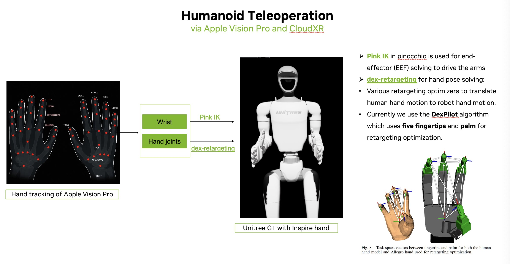
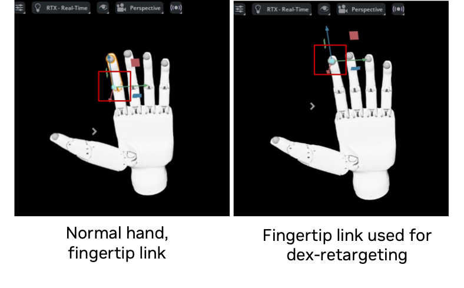
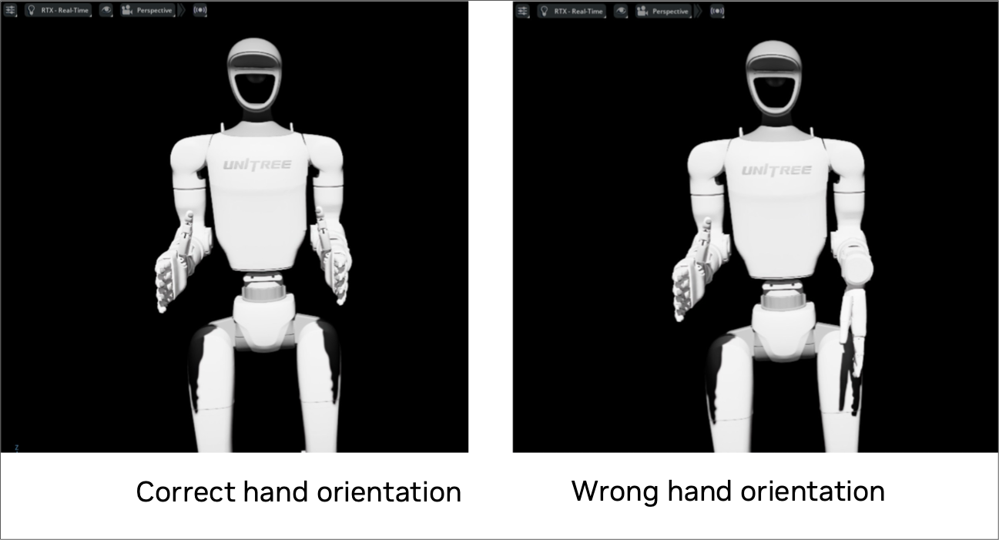

# Teleoperation

This document explains how to set up teleoperation for new humanoid robots, using the Unitree G1 with the Inspire hand as an example.
Steps include:
- Preparing humanoid robot assets, including hands for dex-retargeting.
- Configuring the robot’s articulation.
- Setting up retargeting for the humanoid robot.
- Creating the manipulation task environment.

After completing these steps, you can start data collection and quickly replay demos for verification.

## Teleoperation Diagram via Apple Vision Pro:
Let's start with the teleoperation diagram so you can quickly understand the workflow and algorithms used in teleoperation.

<div align="center">
  
</div>


## Set up teleoperation for new humanoid robots
We will use the Unitree G1 with the Inspire hand as an example in the following sections.

### 1. Preparing humanoid robot assets
#### 1.1 Hand Asset

- The Inspire hand URDF is available at: [`assets/inspire_hand`](https://github.com/unitreerobotics/xr_teleoperate/tree/main/assets/inspire_hand)
- For dex-retargeting, we are currently using the **Dexpilot optimizer**, which relies on the **five fingertips and the palm** for retargeting.
    - It is essential that the links used for retargeting are defined exactly at the fingertips—not in the middle of the fingers—to ensure accurate optimization.
    - If any fingertip links are missing, you can add them directly in IsaacLab as an alternative approach.
- Since no publicly available humanoid model with a suitable hand design was found, we merged the humanoid and hand models ourselves.

> **Tip:**
> Refer to the image below for hand asset selection, or add fingertip links in IsaacLab as needed.
<div align="center">
  
</div>

#### 1.2 Robot Asset

- The Unitree G1 URDF can be found here: [`g1_29dof_with_hand_rev_1_0.urdf`](https://github.com/unitreerobotics/unitree_ros/tree/master/robots/g1_description)

---

#### 1.3 Merging the Unitree G1 with Inspire Hand

- Please refer to this script for merging: [`merge_g1_29dof_and_inspire_hand.ipynb`](https://github.com/unitreerobotics/unitree_ros/blob/master/robots/g1_description/merge_g1_29dof_and_inspire_hand.ipynb)
- **Key requirements:**
    1. Ensure the **base link of the hand** matches the **EEF (end-effector) link** of the humanoid. This guarantees the correct parent–child relationship in the merged model.
        - Example:
          ```
          <link name="left_wrist_yaw_link"/>
          <joint name="left_base_joint" type="fixed">
            <parent link="left_wrist_yaw_link"/>
            <child link="L_hand_base_link"/>
            <origin xyz="0 0 0" rpy="-1.5707963 0 3.14159"/>
          </joint>
          ```
    2. **Ensure the hand’s orientation is correct** when attaching it to the humanoid.
        - If the orientation is incorrect, adjust the `<origin>` tag’s `rpy` parameters manually in the URDF.
        - Example adjustment:
          ```
          <joint name="left_base_joint" type="fixed">
              <parent link="left_wrist_yaw_link" />
              <child link="L_hand_base_link" />
              <origin xyz="0 0 0" rpy="0 0 1.5707963" />
          </joint>
          ```
        - The following image shows the difference between correct and incorrect hand orientation setups：
        <div align="center">
            
        </div>

**Note:**
Make sure the wrist/EEF link names and the parent–child relationship in the joints are consistent across all relevant URDF files.

---
### 2. Configuring the robot’s articulation
#### 2.1 Add the articulation configuration
Now the articulation setting of `G1_INSPIRE_FTP_CFG` located in `unitree.py` of `isaaclab_assets`.
#### 2.2 Takeaways for debugging PD settings
- Proper articulation configuration of the humanoid robot is essential; wrong settings may cause joint over-limit, instability, or unexpected behaviors.
- Please refer to the [Gain Tuner](https://docs.isaacsim.omniverse.nvidia.com/latest/robot_setup/ext_isaacsim_robot_setup_gain_tuner.html)
and [Drive Stability](https://docs.omniverse.nvidia.com/kit/docs/omni_physics/latest/dev_guide/guides/articulation_stability_guide.html#drive-stability).
- Before beginning data collection via teleoperation, it is highly recommended to test the robot's end-effector (EEF) with random point-following tasks
to ensure the PD configuration is correct. This method is more convenient than teleoperation for easy verification.

<div align="center">
  
</div>

### 3. Setting up retargeting for the humanoid robot
Add the Unitree dex-retargeting configuration as described in [dex-retargeting](../../../../../../source/isaaclab/isaaclab/devices/openxr/retargeters/humanoid/unitree/data/configs/dex-retargeting).
- The links specified in `finger_tip_link_names` and `wrist_link_name` are used for retargeting.
- The `target_joint_names` are the driving joints for hand dynamic control, passive/mimic hand joints are not included.
- Sometimes you need to adjust the wrist and hand pose rotations to  achieve correct retargeting, please check the `_retarget_abs` funciton in `unitree_g1_retargeter.py` for wrist,
`_OPERATOR2MANO_RIGHT` and `OPERATOR2MANO_LEFT` matrixes in 'unitree_g1_dex_retargeting_utils.py' regarding hand pose. This is highly important.
```text
retargeting:
  finger_tip_link_names:
  - L_thumb_tip
  - L_index_tip
  - L_middle_tip
  - L_ring_tip
  - L_pinky_tip
  low_pass_alpha: 0.2
  scaling_factor: 1.2
  target_joint_names:
  - L_thumb_proximal_yaw_joint
  - L_thumb_proximal_pitch_joint
  - L_index_proximal_joint
  - L_middle_proximal_joint
  - L_ring_proximal_joint
  - L_pinky_proximal_joint
  type: DexPilot
  urdf_path: /workspace/isaaclab/usecase/humanoid_teleop/g1_29dof_rev_1_0_with_inspire_hand_FTP/retarget_inspire_white_left_hand.urdf
  wrist_link_name: L_hand_base_link
```

### 4. Creating the manipulation task environment.
- Please refer to the [pickplace_unitree_g1_inspire_hand_env_cfg.py](../../../../../../source/isaaclab_tasks/isaaclab_tasks/manager_based/manipulation/pick_place/pickplace_unitree_g1_inspire_hand_env_cfg.py) file for details.
- There are no significant differences compared to other humanoid task environments.

## Data collection and demo replay for quick verification
Please refer to the [Setting up CloudXR Teleoperation](https://isaac-sim.github.io/IsaacLab/main/source/how-to/cloudxr_teleoperation.html#cloudxr-teleoperation)
section for CloudXR setup. As recommended, we use the Opiton 2, run RobotLearningLab(based on Isaac Lab) as a local process with conda env and CloudXR Runtime
container with Docker.

**Steps are as below:**
1. Run an example teleop task with:
```text
python scripts/tools/record_demos.py \
    --task Isaac-PickPlace-G1-InspireFTP-Abs-v0 \
    --teleop_device dualhandtracking_abs \
    --enable_pinocchio
```
2. Replay the collected demos with:
```text
python scripts/tools/replay_demos.py \
    --task Isaac-PickPlace-G1-InspireFTP-Abs-v0 \
    --enable_pinocchio \
    --dataset_file datasets/dataset.hdf5
```
Demo we collected for your reference.

<div align="center">
  
</div>
